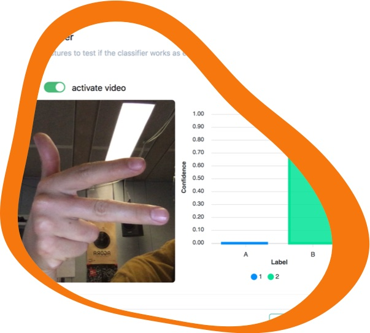
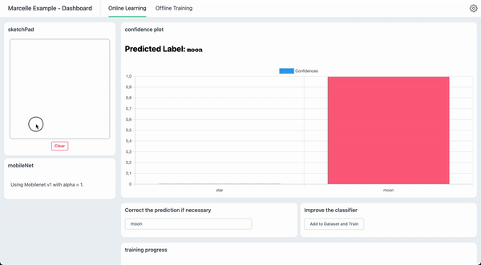
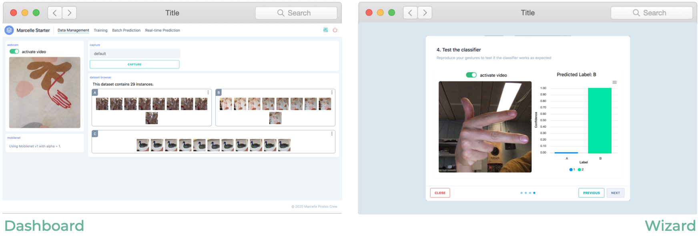
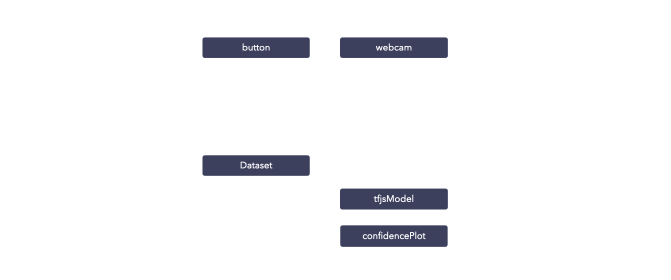

<svg id="visual" viewBox="0 0 900 600" width="900" height="600" xmlns="http://www.w3.org/2000/svg" xmlns:xlink="http://www.w3.org/1999/xlink" version="1.1"><g transform="translate(872.524067255215 -24.3207671090629)"><path d="M349.7 -387.1C442.3 -339.1 498.8 -218.5 516.8 -94.4C534.8 29.7 514.2 157.4 449 248.7C383.7 340 273.8 395.1 161.1 431.1C48.5 467 -66.9 483.9 -126.7 427.7C-186.5 371.4 -190.7 242 -255 141.8C-319.3 41.6 -443.8 -29.3 -464.8 -111.8C-485.7 -194.2 -403.2 -288.2 -308.5 -335.9C-213.8 -383.5 -106.9 -384.8 10.8 -397.6C128.6 -410.5 257.1 -435.1 349.7 -387.1" fill="#FCAF3C"></path></g></svg>

<h1 class="title">Marcelle</h1>

A Toolkit for Composing Interactive Machine Learning Workflows and Interfaces

<!-- <svg id="visual" viewBox="0 0 300 300" width="300" height="300" xmlns="http://www.w3.org/2000/svg" xmlns:xlink="http://www.w3.org/1999/xlink" version="1.1"><g transform="translate(137.1465233658941 164.78352067797127)"><path d="M56.1 -84C75.4 -63.1 95.7 -50.4 116.3 -28.1C136.8 -5.8 157.6 26.1 154.5 54.7C151.4 83.4 124.5 108.8 94.8 118.2C65 127.5 32.5 120.8 3.8 115.5C-24.9 110.2 -49.8 106.5 -73.5 95.2C-97.3 83.9 -120 65.2 -126.7 41.8C-133.5 18.4 -124.3 -9.5 -118.4 -41.9C-112.6 -74.3 -110.1 -111.2 -90.9 -132.1C-71.7 -153 -35.9 -158 -8.7 -146C18.4 -134 36.7 -104.9 56.1 -84" fill="#F7770F"></path></g></svg> -->

**Marcelle** is a modular open source toolkit for programming interactive machine learning applications. Marcelle is built around components embedding computation and interaction that can be composed to form reactive machine learning pipelines and custom user interfaces. This architecture enables rapid prototyping and extension. Marcelle can be used to build interfaces to Python scripts, and it provides flexible data stores to facilitate collaboration between machine learning experts, designers and end users.

<!-- 

<a href="/guide/" class="nav-link action-button">Get Started →</a>
<a href="https://demos.marcelle.dev/" class="nav-link demos">Try the Demos <svg xmlns="http://www.w3.org/2000/svg" aria-hidden="true" focusable="false" x="0px" y="0px" viewBox="0 0 100 100" width="15" height="15" class="icon outbound"><path fill="currentColor" d="M18.8,85.1h56l0,0c2.2,0,4-1.8,4-4v-32h-8v28h-48v-48h28v-8h-32l0,0c-2.2,0-4,1.8-4,4v56C14.8,83.3,16.6,85.1,18.8,85.1z"></path> <polygon fill="currentColor" points="45.7,48.7 51.3,54.3 77.2,28.5 77.2,37.2 85.2,37.2 85.2,14.9 62.8,14.9 62.8,22.9 71.5,22.9"></polygon></svg></a>

 -->

<!-- 
 -->

<!--  -->

<!-- 
 -->

---

<strong>Design Human-AI interactions in minutes.</strong> 
Marcelle provides a high-level API enabling rapid prototyping of applications where human directly interact with machine learning systems.

<!--  -->

---

<h2 class="centered">Features</h2>

<strong>Modular</strong> 
Marcelle is built around various components providing a graphical user interface that can be displayed on demand.
Components can typically be data sources (for instance a webcam capturing images), data structures (such as datasets), models, or visualization.

<strong>Composable</strong> 
Marcelle provides two layout mechanisms for user interface composition: dashboards and wizards.

<strong>Interaction-Driven</strong> 
Marcelle emphasizes machine learning pipelines driven by user interactions, through reactive programming.

<strong>Designed for collaboration</strong> 
Marcelle's data stores enable sharing data and models among stakeholders

