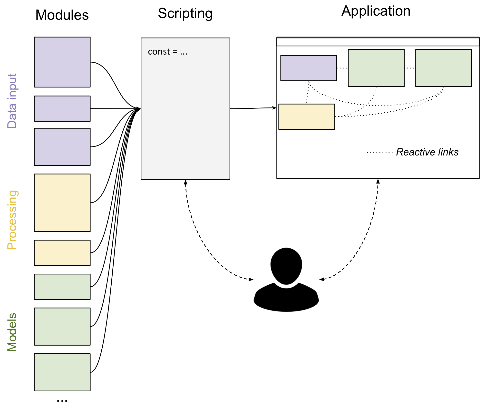

# Core Concepts

## Overview

_Marcelle_ presents itself as a collection of reactive **modules** embedding the state and logic for particular tasks. Modules are the building blocks of a _Marcelle_ application and handle various tasks such as capturing images from a webcam, defining a new dataset, instancing a Deep Neural Network (DNN), displaying a confusion matrix, or monitoring the confidence of a model prediction, to name a few. _Marcelle_ provides two mechanisms to build user interfaces with modules: **dashboards** and **wizards**. Dashboards are applications containing multiple pages where developers can display the views of various modules. Wizards can be programmed to guide end-users or novices through a series of steps.

## Modules

Modules are the building blocks of a Marcelle application and handle various tasks such as capturing images from a webcam, defining a new dataset, instancing a Deep Neural Network (DNN), displaying a confusion matrix, or monitoring the confidence of a model prediction, to name a few. Because Marcelle emphasizes instant feedback and user interaction, modules often provide a graphical user interface that can be displayed on demand in a web application.

> Go to [Modules documentation](/api/modules)

## Streams

In order to facilitate the conception of custom processing pipelines, modules rely on a reactive programming paradigm to generate or react to particular event streams. The reactive programming is well-suited for the development of such event-driven and interactive applications. It facilitates the management of asynchronous data streams, their transformation and the propagation of change to the relevant dependents.
Each module exposes a set of data streams containing the various events produced by the module. These data streams can easily be manipulated (filtered, transformed, combined) and plugged into other modules to define pipelines.

> Go to [Streams documentation](/api/streams)

## Interfaces

Most modules provide a view that can be mounted on demand in an application. Marcelle provides two mechanisms to build user interfaces with modules: **dashboards** and **wizards**. Dashboards are applications containing multiple pages where developers can display the views of various modules. Wizards can be programmed to guide end-users or novices through a series of steps.

> Go to [Interfaces documentation](/api/interfaces)

## Backends

Marcelle provides a flexible interface for creating _backend services_ that provide a unified interface for storing data either on the client side (in memory or using web storage) or on a remote server.
Some modules rely on the definition of a backend &ndash; for instance, the [Dataset](/modules/data#dataset) module that needs to store instances, &ndash; however data collections can be created on the fly to store custom information when relevant. This is particularly useful to store some of the state of the application (for instance the model's parameters), a history of changes to the application, or custom session logs recording some of the user's interactions.

> Go to [Backends documentation](/api/backends)
