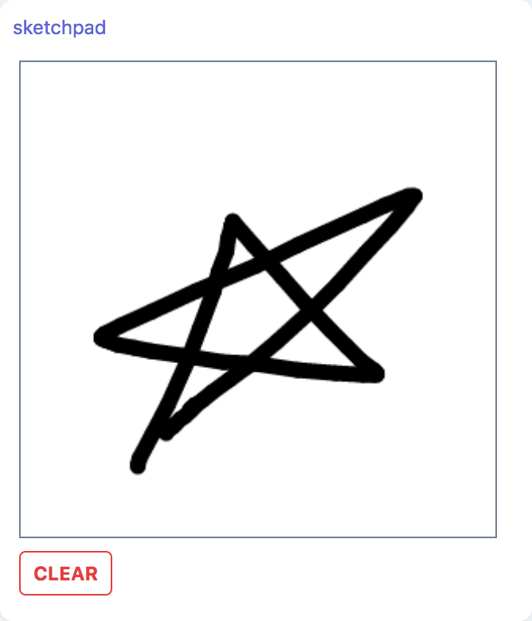
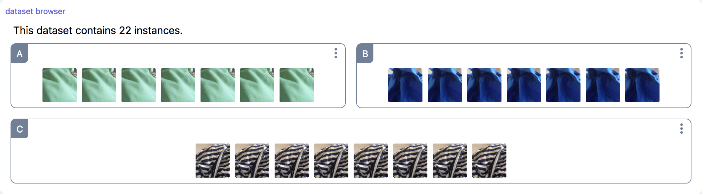
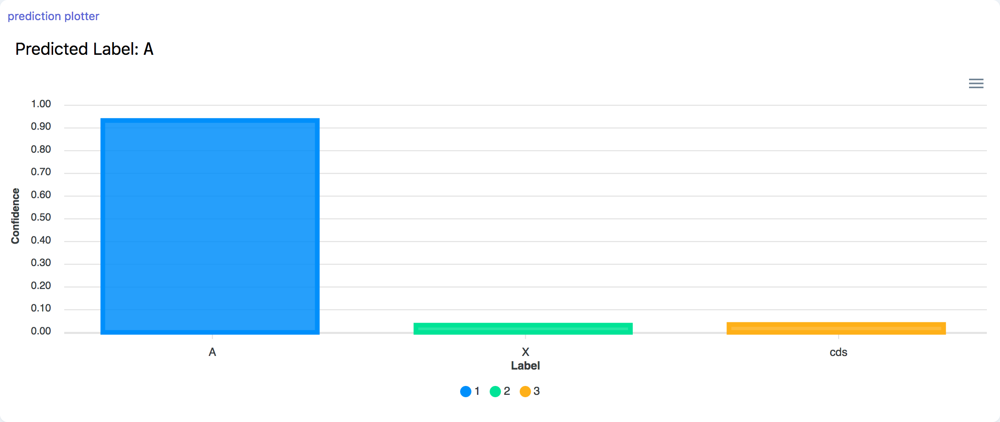
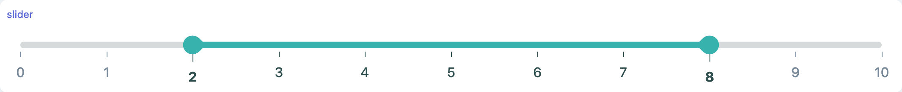
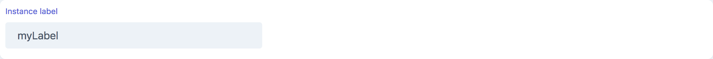

# Components

## Charts

### genericChart

```tsx
genericChart({
  preset?: 'line' | 'line-fast' | 'bar' | 'bar-fast';
  options?: ChartOptions;
}): Chart;
```

A Charting component using the [Chart.js](#) library, to visualize data streams.

#### Parameters

| Option  | Type         | Description                                                                     | Required | Default |
| ------- | ------------ | ------------------------------------------------------------------------------- | :------: | :-----: |
| preset  | string       | The chart preset. Available presets are 'line', 'line-fast', 'bar', 'bar-fast'. |          | 'line'  |
| options | ChartOptions | Custom Chart Options                                                            |          |   {}    |

Custom chart options can be passed as an object that is compatible with Chart.js's options ([see online documentation](https://www.chartjs.org/docs/next/)), with 2 additional shorthand options `xlabel` and `ylabel`.

#### Screenshot

<div style="background: rgb(237, 242, 247); padding: 8px; margin-top: 1rem;">
  
</div>

#### Example

```js
TODO;
```

### scatterPlot

```tsx
scatterPlot(
  dataset: Stream<number[][]>,
  labels: Stream<string[] | number[]>
  ): ScatterPlot;
```

A scatter plot component using the [scatterGL](https://github.com/PAIR-code/scatter-gl) library.

#### Parameters

| Option  | Type                           | Description                                                                         | Required |
| ------- | ------------------------------ | ----------------------------------------------------------------------------------- | :------: |
| dataset | Stream\<number[][]\>           | Stream of number arrays containing 2-dimensional data to be plotted                 |    ✓     |
| labels  | Stream\<string[] \| number[]\> | Stream of labels (either as strings or numbers) used to apply colors on data points |    ✓     |

<!-- #### Screenshot

```js
TODO;
```

#### Example

```js
TODO;
``` -->

## Data sources

### fileUpload

```tsx
marcelle.fileUpload(): fileUpload;
```

A file upload component, that creates a stream of files.

#### Streams

| Name    | Type              | Description     | Hold |
| ------- | ----------------- | --------------- | :--: |
| \$files | Stream\<never()\> | Stream of files |

#### Example

```js
const myFileUpload = marcelle.fileUpload();
myFileUpload.$files.subscribe((x) => console.log('fileUpload $files:', x));
```

### imageUpload

```tsx
marcelle.imageUpload({ width?: number, height?: number }): ImageUpload;
```

An Image upload component, that creates a stream of images and thumbnails. Images are cropped and rescaled to match the target dimensions, if these are non-zero, otherwise the dimensions are unchanged.

#### Parameters

| Option | Type   | Description         | Required | Default |
| ------ | ------ | ------------------- | :------: | :-----: |
| width  | number | Target image width  |          |    0    |
| height | number | Target image height |          |    0    |

#### Streams

| Name         | Type                | Description                                                                                                                        | Hold |
| ------------ | ------------------- | ---------------------------------------------------------------------------------------------------------------------------------- | :--: |
| \$images     | Stream\<ImageData\> | Stream of images in the [ImageData](https://developer.mozilla.org/en-US/docs/Web/API/ImageData) format.                            |
| \$thumbnails | Stream\<string\>    | Stream of thumbnail images in base64 [dataURI](https://developer.mozilla.org/en-US/docs/Web/HTTP/Basics_of_HTTP/Data_URIs) format. |      |

#### Screenshot

<div style="background: rgb(237, 242, 247); padding: 8px; margin-top: 1rem;">
  
</div>

#### Example

```js
const imgUpload = marcelle.imageUpload();
imgUpload.$images.subscribe((x) => console.log('imageUpload $images:', x));
```

### sketchPad

```tsx
marcelle.sketchpad(): Sketchpad;
```

An input sketching component allowing the user to draw. The generate generates a stream of images of the sketches, as well as stream for various user actions.

#### Streams

| Name          | Type                | Description                                                                                                                        | Hold |
| ------------- | ------------------- | ---------------------------------------------------------------------------------------------------------------------------------- | :--: |
| \$images      | Stream\<ImageData\> | Stream of images in the [ImageData](https://developer.mozilla.org/en-US/docs/Web/API/ImageData) format.                            |
| \$thumbnails  | Stream\<string\>    | Stream of thumbnail images in base64 [dataURI](https://developer.mozilla.org/en-US/docs/Web/HTTP/Basics_of_HTTP/Data_URIs) format. |      |
| \$strokeStart | Stream\<undefined\> | Stream of empty (undefined) events occurring every time the user starts drawing                                                    |      |
| \$strokeEnd   | Stream\<undefined\> | Stream of empty (undefined) events occurring every time the user stops drawing                                                     |      |

#### Screenshot

<div style="background: rgb(237, 242, 247); padding: 8px; margin-top: 1rem;">
  
</div>

#### Example

```js
const sketch = marcelle.sketchpad();
sketch.$strokeStart.subscribe(() => console.log('sketchpad $strokeStart'));
sketch.$strokeEnd.subscribe(() => console.log('sketchpad $strokeEnd'));
```

### webcam

```tsx
marcelle.webcam({ width?: number, height?: number, period?: number }): Webcam;
```

A webcam source component, producing a periodic stream of images.

#### Parameters

| Option | Type   | Description                                  | Required | Default |
| ------ | ------ | -------------------------------------------- | :------: | :-----: |
| width  | number | The target image width                       |          |   224   |
| height | number | The target image height                      |          |   224   |
| period | number | The period in ms at which images are sampled |          |   50    |

#### Streams

| Name          | Type                  | Description                                                                                                                        | Hold |
| ------------- | --------------------- | ---------------------------------------------------------------------------------------------------------------------------------- | :--: |
| \$images      | Stream\<ImageData\>   | Stream of images in the [ImageData](https://developer.mozilla.org/en-US/docs/Web/API/ImageData) format.                            |
| \$thumbnails  | Stream\<string\>      | Stream of thumbnail images in base64 [dataURI](https://developer.mozilla.org/en-US/docs/Web/HTTP/Basics_of_HTTP/Data_URIs) format. |      |
| \$active      | Stream\<boolean\>     | Boolean stream specifying if the webcam is active (streaming)                                                                      |      |
| \$ready       | Stream\<boolean\>     | Boolean stream specifying if the webcam is ready                                                                                   |      |
| \$mediastream | Stream\<MediaStream\> | Stream of MediaStream corresponding to the selected webcam. Events are emitted whenever a webcam is selected.                      |      |

#### Screenshot

<div style="background: rgb(237, 242, 247); padding: 8px; margin-top: 1rem;">
  
</div>

#### Example

```js
const webcam = marcelle.webcam();
webcam.$images.subscribe((x) => console.log('webcam $images:', x));
```

## Data displays

### datasetBrowser

```tsx
marcelle.datasetBrowser(dataset: Dataset<InputType, string>): DatasetBrowser;
```

A Dataset browser provides an interface to visualize the contents of a dataset. It takes a dataset as argument, assuming that each instance contains a `thumbnail` property that can be displayed as an image (typically, a base64 dataURI).

#### Parameters

| Option  | Type    | Description              | Required |
| ------- | ------- | ------------------------ | :------: |
| dataset | Dataset | The dataset to visualize |    ✓     |

#### Screenshot

<div style="background: rgb(237, 242, 247); padding: 8px; margin-top: 1rem;">
  
</div>

#### Example

```js
const trainingSetBrowser = marcelle.datasetBrowser(trainingSet);
dashboard.page('Data Management').use(trainingSetBrowser);
```

### imageDisplay

```tsx
marcelle.imageDisplay(imageStream: Stream<ImageData> | Stream<ImageData[]>): DatasetBrowser;
```

An Image Display allows for displaying an image on screen provided by an input stream.

#### Parameters

| Option      | Type                                         | Description                                                                                        | Required |
| ----------- | -------------------------------------------- | -------------------------------------------------------------------------------------------------- | :------: |
| imageStream | Stream\<ImageData\> \| Stream\<ImageData[]\> | Stream of images of [ImageData](https://developer.mozilla.org/en-US/docs/Web/API/ImageData) format |    ✓     |

<!-- #### Screenshot

<div style="background: rgb(237, 242, 247); padding: 8px; margin-top: 1rem;">
  
</div> -->

#### Example

```js
const source = imageUpload({ width: 224, height: 224 });
const instanceViewer = marcelle.imageDisplay(source.$images);
dashboard.page('Data').use(instanceViewer);
```

## Datasets

### Dataset

```tsx
marcelle.dataset(name: string, store: DataStore): Dataset;
```

A Dataset component allowing for capturing instances from a stream, storing them in a local or remote [data-store](/api/data-stores.html).

#### Parameters

| Option | Type      | Description                                                                   | Required |
| ------ | --------- | ----------------------------------------------------------------------------- | :------: |
| name   | string    | The dataset name                                                              |    ✓     |
| store  | DataStore | The [dataStore](/api/data-stores) used to store the instances of the dataset. |    ✓     |

#### Streams

| Name      | Type                      | Description                                                                                                                                                                                              | Hold |
| --------- | ------------------------- | -------------------------------------------------------------------------------------------------------------------------------------------------------------------------------------------------------- | :--: |
| \$count   | Stream\<number\>          | Total number of instances in the dataset                                                                                                                                                                 |      |
| \$changes | Stream\<DatasetChange[]\> | Stream of changes applied to the dataset. Changes can concern a number of modifications (creation, update, deletion, ...) at various levels (dataset, class, instance). The interface is described below |      |

Where dataset changes have the following interface:

```ts
interface DatasetChange {
  level: 'instance' | 'dataset';
  type: 'created' | 'updated' | 'removed' | 'renamed';
  data?: unknown;
}
```

#### Methods

<!-- ##### .capture()

```tsx
capture(instanceStream: Stream<Instance>): void
```

Capture instances to a dataset from a reactive stream. Each event on the stream should respect the `Instance` interface:

```ts
interface Instance {
  label: string;
  data: unknown;
  thumbnail?: string;
  features?: number[][];
  type?: string;
  [key: string]: any; // eslint-disable-line @typescript-eslint/no-explicit-any
}
``` -->

##### .clear()

```tsx
async clear(): Promise<void>
```

Clear the dataset, removing all instances.

##### .create()

```tsx
async create(instance: Instance<InputType, OutputType>, params?: FeathersParams): Promise<Instance<InputType, OutputType>>
```

Create an instance in the dataset

| Option   | Type                              | Description                                                                                              | Required |
| -------- | --------------------------------- | -------------------------------------------------------------------------------------------------------- | :------: |
| instance | Instance\<InputType, OutputType\> | The instance data                                                                                        |    ✓     |
| params   | FeathersParams                    | Feathers Query parameters. See [Feathers docs](https://docs.feathersjs.com/api/databases/querying.html). |          |

##### .download()

```tsx
async download(): Promise<void>
```

Download the dataset as a unique json file.

##### .get()

```tsx
async get(id: ObjectId, params?: FeathersParams): Promise<Instance<InputType, OutputType>>
```

Get an instance from the dataset by ID, optionally passing Feathers parameters.

| Option | Type           | Description                                                                                              | Required |
| ------ | -------------- | -------------------------------------------------------------------------------------------------------- | :------: |
| id     | ObjectId       | The instance's unique ID                                                                                 |    ✓     |
| params | FeathersParams | Feathers Query parameters. See [Feathers docs](https://docs.feathersjs.com/api/databases/querying.html). |          |

##### .items()

```tsx
items(): ServiceIterable<Instance<InputType, OutputType>>
```

Get a lazy service iterable to iterate over the dataset.

::: warning TODO
Document lazy iterables and service iterables in data stores?
:::

Example:

```ts
const instances = await dataset
  .items() // get iterable
  .query({ label: 'A' }) // query instances with label 'A'
  .select(['id', 'thumbnail']) // select the fields to return
  .toArray(); // convert to array
```

##### .patch()

```tsx
patch(id: ObjectId, changes: Partial<Instance>, params?: FeathersParams): Promise<Instance>
```

Patch an instance in the dataset

| Option  | Type                | Description                                                                                              | Required |
| ------- | ------------------- | -------------------------------------------------------------------------------------------------------- | :------: |
| id      | ObjectId            | The instance's unique ID                                                                                 |    ✓     |
| changes | Partial\<Instance\> | The instance data                                                                                        |    ✓     |
| params  | FeathersParams      | Feathers Query parameters. See [Feathers docs](https://docs.feathersjs.com/api/databases/querying.html). |          |

##### .remove()

```tsx
remove(id: ObjectId, params?: FeathersParams): Promise<Instance>
```

Remove an instance from the dataset

| Option | Type           | Description                                                                                              | Required |
| ------ | -------------- | -------------------------------------------------------------------------------------------------------- | :------: |
| id     | ObjectId       | The instance's unique ID                                                                                 |    ✓     |
| params | FeathersParams | Feathers Query parameters. See [Feathers docs](https://docs.feathersjs.com/api/databases/querying.html). |          |

##### .update()

```tsx
update(id: ObjectId, instance: Instance<InputType, OutputType>, params?: FeathersParams): Promise<Instance>
```

Update an instance in the dataset

| Option   | Type                              | Description                                                                                              | Required |
| -------- | --------------------------------- | -------------------------------------------------------------------------------------------------------- | :------: |
| id       | ObjectId                          | The instance's unique ID                                                                                 |    ✓     |
| instance | Instance\<InputType, OutputType\> | The instance data                                                                                        |    ✓     |
| params   | FeathersParams                    | Feathers Query parameters. See [Feathers docs](https://docs.feathersjs.com/api/databases/querying.html). |          |

##### .upload()

```tsx
async upload(files: File[]): Promise<void>
```

Upload a dataset from files.

| Option | Type   | Description                 | Required |
| ------ | ------ | --------------------------- | :------: |
| files  | File[] | Array of files of type File |    ✓     |

#### Example

```js
const store = marcelle.dataStore('localStorage');
const trainingSet = marcelle.dataset('TrainingSet', store);
trainingSet.capture($instances); // Capture a Stream of instances
```

## Model interface

### modelParameters

### trainingProgress

### trainingPlot

## Models

### cocoSsd

```tsx
cocoSsd({ base?: string }): CocoSsd;
```

Object detection model based on tensorflow's [COCO-SSD](https://github.com/tensorflow/tfjs-models/tree/master/coco-ssd) implementation. The model localizes and identifies multiple objects in a single image.

#### Parameters

| Option | Type   | Description                                                                                                                                                                                                             | Required | Default             |
| ------ | ------ | ----------------------------------------------------------------------------------------------------------------------------------------------------------------------------------------------------------------------- | :------: | ------------------- |
| base   | string | Controls the base cnn model, can be 'mobilenet_v1', 'mobilenet_v2' or 'lite_mobilenet_v2'. lite_mobilenet_v2 is smallest in size, and fastest in inference speed. mobilenet_v2 has the highest classification accuracy. |          | 'lite_mobilenet_v2' |

#### Streams

| Name      | Type              | Description                     | Hold |
| --------- | ----------------- | ------------------------------- | :--: |
| \$loading | Stream\<boolean\> | Defines if the model is loading |  ✓   |

#### Methods

##### .predict()

```tsx
async predict(img: ImageData): Promise<ObjectDetectorResults>
```

Make a prediction from an input image in `ImageData` format. The method is asynchronous and returns a promise that resolves with the results of the prediction. The results have the following signature:

```ts
interface ObjectDetectorResults {
  outputs: {
    bbox: [number, number, number, number];
    class: string;
    confidence: number;
  }[];
}
```

#### Example

```js
const source = marcelle.imageUpload();
const cocoClassifier = marcelle.cocoSsd();

const cocoPredictionStream = source.$images
  .map(async (img) => cocoClassifier.predict(img))
  .awaitPromises();
```

### knnClassifier

```tsx
marcelle.knnClassifier({ k?: number, dataStore: DataStore }): KNNClassifier;
```

A K-Nearest Neighbors classifier based on [Tensorflow.js's implementation](https://github.com/tensorflow/tfjs-models/tree/master/knn-classifier).

#### Parameters

| Option    | Type      | Description                                                                                                                                                                                                                                                                      | Required | default |
| --------- | --------- | -------------------------------------------------------------------------------------------------------------------------------------------------------------------------------------------------------------------------------------------------------------------------------- | :------: | ------- |
| k         | number    | The K value to use in K-nearest neighbors. The algorithm will first find the K nearest examples from those it was previously shown, and then choose the class that appears the most as the final prediction for the input example. Defaults to 3. If examples < k, k = examples. |          | 3       |
| dataStore | DataStore | The [dataStore](/api/data-stores) used to store the model. This parameter is optional.                                                                                                                                                                                           |          |

The set of reactive parameters has the following signature:

```ts
parameters: {
  k: Stream<number>;
}
```

#### Streams

| Name       | Type                     | Description                                                           | Hold |
| ---------- | ------------------------ | --------------------------------------------------------------------- | :--: |
| \$training | Stream\<TrainingStatus\> | Stream of training status events (see above), with no additional data |      |

#### Methods

##### .clear()

```tsx
clear(): void
```

Clear the model, removing all instances

##### .predict()

```tsx
async predict(x: number[][]): Promise<ClassifierResults>
```

Make a prediction from an input feature array `x`. The method is asynchronous and returns a promise that resolves with the results of the prediction. The results have the following signature:

```ts
interface ClassifierResults {
  label: string;
  confidences: { [key: string]: number };
}
```

##### .train()

```tsx
train(dataset: Dataset): void
```

Train the model from a given dataset.

#### Example

```js
const classifier = marcelle.knnClassifier({ k: 5 });
classifier.train(trainingSet);

const predictionStream = $featureStream // A stream of input features
  .map(async (features) => classifier.predict(features))
  .awaitPromises();
```

### mlpClassifier

```tsx
marcelle.mlpClassifier({
  layers?: number[],
  epochs?: number,
  batchSize?: number,
  dataStore: DataStore
  }): MLPClassifier;
```

A Multi-Layer Perceptron using Tensorflow.js. The configuration of the model (number of layers and number of hidden nodes per layer) can be configured.

#### Parameters

| Option    | Type      | Description                                                                                                                                | Required | Default  |
| --------- | --------- | ------------------------------------------------------------------------------------------------------------------------------------------ | :------: | -------- |
| layers    | number[]  | The model configuration as an array of numbers, where each element defines a layer with the given number of hidden nodes                   |          | [64, 32] |
| epochs    | number    | Number of epochs used for training                                                                                                         |          | 20       |
| batchSize | number    | Training data batch size                                                                                                                   |          | 8        |
| dataStore | DataStore | The [dataStore](/api/data-stores) used to store the model. This parameter is optional. By default, a data store in memory will be created. |          |

The set of reactive parameters has the following signature:

```ts
parameters {
  layers: Stream<number[]>;
  epochs: Stream<number>;
  batchSize: Stream<number>;
}
```

#### Streams

| Name       | Type                     | Description                                                                                                                                                                                               | Hold |
| ---------- | ------------------------ | --------------------------------------------------------------------------------------------------------------------------------------------------------------------------------------------------------- | :--: |
| \$training | Stream\<TrainingStatus\> | Stream of training status events, containing the current status ('idle' / 'start' / 'epoch' / 'success' / 'error'), the current epoch and associated data (such as loss and accuracy) during the training |      |

#### Methods

##### .clear()

```tsx
clear(): void
```

Clear the model, removing all instances

##### .predict()

```tsx
async predict(x: number[][]): Promise<MLPResults>
```

Make a prediction from an input feature array `x`. The method is asynchronous and returns a promise that resolves with the results of the prediction. The results have the following signature:

```ts
interface MLPResults {
  label: string;
  confidences: { [key: string]: number };
}
```

##### .train()

```tsx
train(dataset: Dataset): void
```

Train the model from a given dataset.

#### Example

```js
const classifier = marcelle.mlpClassifier({ layers: [64, 32], epochs: 50 });
classifier.train(trainingSet);

const predictionStream = $featureStream // A stream of input features
  .map(async (features) => classifier.predict(features));
  .awaitPromises();
```

### mobileNet

```tsx
marcelle.mobileNet({
  version?: 1 | 2,
  alpha?: 0.25 | 0.50 | 0.75 | 1.0,
}): MobileNet;
```

The mobileNet component can be used both as a classification model and as a feature extractor. It is based on [Tensorflow.js's Mobilenet implementation](https://github.com/tensorflow/tfjs-models/tree/master/mobilenet). For feature extraction, the `.process()` method can be used to get the embeddings from an input image.

#### Parameters

| Option  | Type                        | Description                                                                                                                                                                                                                                                        | Required |
| ------- | --------------------------- | ------------------------------------------------------------------------------------------------------------------------------------------------------------------------------------------------------------------------------------------------------------------ | :------: |
| version | 1 \| 2                      | The MobileNet version number. Use 1 for [MobileNetV1](https://github.com/tensorflow/models/blob/master/research/slim/nets/mobilenet_v1.md), and 2 for [MobileNetV2](https://github.com/tensorflow/models/tree/master/research/slim/nets/mobilenet). Defaults to 1. |          |
| alpha   | 0.25 \| 0.50 \| 0.75 \| 1.0 | Controls the width of the network, trading accuracy for performance. A smaller alpha decreases accuracy and increases performance. 0.25 is only available for V1. Defaults to 1.0.                                                                                 |          |

Since parameters are used to load a heavy model, they can only be used on when the component is created, and there are not reactive parameters.

#### Methods

##### .predict()

```tsx
async predict(image: ImageData): Promise<MobilenetResults>
```

Make a prediction from an input image `image` in ImageData format. The method is asynchronous and returns a promise that resolves with the results of the prediction. The results have the following signature:

```ts
interface MobilenetResults {
  label: string;
  confidences: { [key: string]: number };
}
```

##### .process()

```tsx
async process(image: ImageData): Promise<number[][]>
```

Use mobilenet for feature extraction, for example to perform transfer learning. The method returns the embedding for the input image. The size of the embedding depends on the alpha (width) of the model.

#### Example

```js
const input = marcelle.webcam();
const m = marcelle.mobileNet();

// Extract features (embedding) from webcam images
const $embedding = input.$images.map((img) => m.process(img)).awaitPromises();

// Predict labels from webcam images (default mobilenet classification)
const $prediction = input.$images.map((img) => m.predict(img)).awaitPromises();
```

### tfjsModel

```tsx
tfjsModel({
  inputType: 'image' | 'generic';
  taskType: 'classification' | 'segmentation' | 'generic';
  segmentationOptions?: {
    output?: 'image' | 'tensor';
    applyArgmax?: boolean;
  };
}): TFJSGenericModel;
```

This component allows to make predictions using pre-trained Tensorflow.js models, in either [LayersModel](https://js.tensorflow.org/api/latest/#class:LayersModel) or [GraphModel](https://js.tensorflow.org/api/latest/#class:GraphModel) format. This component supports:

- Models created with the tf.layers.\*, tf.sequential(), and tf.model() APIs of TensorFlow.js and later saved with the tf.LayersModel.save() method.
- Models converted from Keras or TensorFlow using the tensorflowjs_converter.

It supports several types of input (currently, images or arrays), as well as several types of task (classification, segmentation, generic prediction). Pre-trained models can be loaded either by URL, or through file upload, for instance using the [`fileUpload`](/api/components/widgets.html#fileupload) component.

Such generic models cannot be trained.

::: tip
Note that exporting models from Keras to TFJS can lead to loading errors when particular layers are not implemented in TFJS. In this case, it is possible to export the Keras model to a saved_model and convert it to TFJS, where compatibility should be better.
:::

#### Methods

##### .loadFromFiles()

```tsx
async loadFromFiles(files: File[]): Promise<void>
```

Load a pre-trained TFJS model from a list files, that should include:

- a `model.json` file defining the model artifacts
- one or several `.bin` weight files

##### .loadFromUrl()

```tsx
async loadFromUrl(url: string): Promise<void>
```

Load a pre-trained TFJS model from a URL.

##### .predict()

```tsx
async predict(input: InputType): Promise<OutputType>
```

Make a prediction from an input instance, which type depends on the `inputType` specified in the constructor. The method is asynchronous and returns a promise that resolves with the results of the prediction.

Input types can be:

- `ImageData` if the model was instanciated with `inputType: 'image'`
- `TensorLike` (= array) if the model was instanciated with `inputType: 'generic'`

Output types can be:

- `ClassifierResults` if the model was instanciated with `taskType: 'classification'`
- `ImageData | TensorLike` if the model was instanciated with `taskType: 'segmentation'`
- `TensorLike` if the model was instanciated with `taskType: 'generic'`

Where classifier results have the following interface:

```ts
interface ClassifierResults {
  label: string;
  confidences: { [key: string]: number };
}
```

#### Example

```js
const source = imageUpload();
const classifier = tfjsModel({
  inputType: 'image',
  taskType: 'classification',
});
classifier.loadFromUrl();

const predictionStream = source.$images.map(async (img) => classifier.predict(img)).awaitPromises();
```

## Prediction displays

### confidencePlot

```tsx
marcelle.confidencePlot(
  predictionStream: Stream<Prediction>
): ConfidencePlot;
```

Plot prediction result in real-time from a reactive stream of predictions, where each event implements the following interface:

```ts
interface Prediction {
  id?: ObjectId;
  instanceId: ObjectId;
  label?: string;
  trueLabel?: string;
  confidences?: Record<string, number>;
  [key: string]: any; // eslint-disable-line @typescript-eslint/no-explicit-any
}
```

#### Parameters

| Option           | Type                 | Description                    | Required |
| ---------------- | -------------------- | ------------------------------ | :------: |
| predictionStream | Stream\<Prediction\> | a stream of Prediction objects |    ✓     |

#### Screenshot

<div style="background: rgb(237, 242, 247); padding: 8px; margin-top: 1rem;">
  
</div>

#### Example

```js
const predictionStream = $features.map((feat) => classifier.predict(feat)).awaitPromises();

const plotResults = marcelle.confidencePlot(predictionStream);
```

### detectionBoxes

```tsx
marcelle.detectionBoxes(
  imgStream: Stream<ImageData>,
  objDectectionRes: Stream<ObjectDetectorResults>
): DetectionBoxes;
```

Plot detection boxes on an image given by a segmentation algorithm. `ObjectDetectorResults` has the following interface:

```ts
interface ObjectDetectorResults {
  outputs: {
    bbox: [number, number, number, number];
    class: string;
    confidence: number;
  }[];
}
```

#### Parameters

| Option           | Type                            | Description                          | Required |
| ---------------- | ------------------------------- | ------------------------------------ | :------: |
| imgStream        | Stream\<ImageData\>             | A stream of image                    |    ✓     |
| objDectectionRes | Stream\<ObjectDetectorResults\> | A stream of object detection results |    ✓     |

#### Example

```js
const source = imageUpload();
const cocoClassifier = cocoSsd();

// prediction using cocoSsd algorithm
const cocoPredictionStream = source.$images
  .map(async (img) => cocoClassifier.predict(img))
  .awaitPromises();

// build predictions
const cocoBetterPredictions = cocoPredictionStream.map(({ outputs }) => ({
  label: outputs[0].class,
  confidences: outputs.reduce((x, y) => ({ ...x, [y.class]: y.confidence }), {}),
}));

const objDetectionVis = detectionBoxes(source.$images, cocoPredictionStream);
```

### ConfusionMatrix

```tsx
marcelle.confusionMatrix(prediction: BatchPrediction): Confusion;
```

Displays a confusion matrix from a [BatchPrediction](#batchprediction) component.

#### Parameters

| Option     | Type            | Description                                               | Required |
| ---------- | --------------- | --------------------------------------------------------- | :------: |
| prediction | BatchPrediction | A batch prediction component storing a set of predictions |    ✓     |

#### Screenshot

<div style="background: rgb(237, 242, 247); padding: 8px; margin-top: 1rem;">
  
</div>

#### Example

```js
const batchMLP = marcelle.batchPrediction({ name: 'mlp', dataStore: store });
const confusionMatrix = marcelle.confusionMatrix(batchMLP);
```

## Widgets

### button

```tsx
marcelle.button({ text: string }): Button;
```

A generic GUI button component.

#### Parameters

| Option | Type            | Description            | Required |
| ------ | --------------- | ---------------------- | :------: |
| text   | string/function | The text of the button |          |

#### Streams

| Name      | Type      | Description                                                 | Hold |
| --------- | --------- | ----------------------------------------------------------- | :--: |
| \$click   | undefined | Stream of click events                                      |      |
| \$pressed | boolean   | Stream of binary events indicating is the button is pressed |      |
| \$text    | boolean   | Stream defining the button text                             |      |

#### Screenshot

<div style="background: rgb(237, 242, 247); padding: 8px; margin-top: 1rem;">
  
</div>

#### Example

```js
const capture = marcelle.button({ text: 'Hold to record instances' });
capture.name = 'Capture instances to the training set';

capture.$click.subscribe((x) => console.log('button $click:', x));
```

### select

```tsx
marcelle.select({ options: string[], value?: string }): Select;
```

A generic GUI Select component.

#### Parameters

| Option  | Type     | Description                                      | Required |
| ------- | -------- | ------------------------------------------------ | :------: |
| options | string[] | The select menu options                          |    ✓     |
| value   | string   | The default value (by default, the first option) |    ✓     |

#### Streams

| Name      | Type     | Description              | Hold |
| --------- | -------- | ------------------------ | :--: |
| \$options | string[] | Stream of menu options   |  ✓   |
| \$value   | string   | Stream of selected value |  ✓   |

#### Screenshot

<div style="background: rgb(237, 242, 247); padding: 8px; margin-top: 1rem;">
  
</div>

#### Example

```js
const sel = marcelle.select({ options: ['one', 'two', 'three'], value: 'two' });
sel.$value.subscribe((x) => console.log('sel $value:', x));
```

### slider

```tsx
slider({
  values: number[],
  min: number,
  max: number,
  step: number,
  range: boolean | 'min' | 'max',
  float: boolean,
  vertical: boolean,
  pips: boolean,
  pipstep: number,
  formatter: (x: unknown) => unknown,
}): Slider;
```

A generic slider widget, allowing multiple thumbs.

#### Parameters

| Option    | Type                      | Description                                                                                                                                                                                                                     | Required |  Default  |
| --------- | ------------------------- | ------------------------------------------------------------------------------------------------------------------------------------------------------------------------------------------------------------------------------- | :------: | :-------: |
| values    | number[]                  | The default values                                                                                                                                                                                                              |          |   [0.2]   |
| min       | number                    | minimum value                                                                                                                                                                                                                   |          |     0     |
| max       | number                    | maximum value                                                                                                                                                                                                                   |          |     1     |
| step      | number                    | step size                                                                                                                                                                                                                       |          |   0.01    |
| range     | boolean \| 'min' \| 'max' | Specifies the slider bar display. If false, no bar is displayed. If true, the bar is displayed as a range between several values. If 'min' (resp. 'max'), the slider bar is displayed from the minimum (resp. 'maximum') value. |          |   'min'   |
| float     | boolean                   | specifies if the value should be displayed in a floating indicator on hover                                                                                                                                                     |          |   true    |
| vertical  | boolean                   | display the slider vertically                                                                                                                                                                                                   |          |   false   |
| pips      | boolean                   | display pips (ticks)                                                                                                                                                                                                            |          |   false   |
| pipstep   | number                    | Pip step size                                                                                                                                                                                                                   |          | undefined |
| formatter | (x: unknown) => unknown   | The function used for formatting the pips and floating indicator                                                                                                                                                                |          | (x) => x  |

#### Streams

| Name     | Type   | Description              | Hold |
| -------- | ------ | ------------------------ | :--: |
| \$values | string | Stream of selected value |  ✓   |
| \$min    | string | Stream of selected value |  ✓   |
| \$max    | string | Stream of selected value |  ✓   |
| \$step   | string | Stream of selected value |  ✓   |

#### Screenshot

<div style="background: rgb(237, 242, 247); padding: 8px; margin-top: 1rem;">
  
</div>

#### Example

```js
const slider = marcelle.slider({
  values: [2, 8],
  min: 0,
  max: 10,
  pips: true,
  step: 1,
  range: true,
});
slider.$values.subscribe((x) => console.log('slider $values:', x));
```

### text

```tsx
marcelle.text({ text: string }): Text;
```

A generic GUI text display component accepting HTL strings.

#### Parameters

| Option | Type            | Description             | Required |
| ------ | --------------- | ----------------------- | :------: |
| text   | string/function | The text of the togggle |          |

#### Streams

| Name   | Type    | Description                      | Hold |
| ------ | ------- | -------------------------------- | :--: |
| \$text | boolean | Stream defining the text content |      |

#### Screenshot

<div style="background: rgb(237, 242, 247); padding: 8px; margin-top: 1rem;">
  
</div>

#### Example

```js
const t = marcelle.text({
  text: 'Just some <strong>HTML</strong> text content... Accepts HTML: <button class="btn">button</button>',
});
```

### textInput

```tsx
marcelle.textInput(): Textfield;
```

A generic GUI text field (input) component.

#### Streams

| Name   | Type    | Description                       | Hold |
| ------ | ------- | --------------------------------- | :--: |
| \$text | boolean | Stream defining the input's value |      |

#### Screenshot

<div style="background: rgb(237, 242, 247); padding: 8px; margin-top: 1rem;">
  
</div>

#### Example

```js
const label = marcelle.textInput();
label.name = 'Instance label';

label.$text.subscribe(console.log);
label.$text.set('myLabel');
```

### toggle

```tsx
marcelle.toggle({ text: string }): Toggle;
```

A generic GUI toggle (switch) component.

#### Parameters

| Option | Type            | Description             | Required |
| ------ | --------------- | ----------------------- | :------: |
| text   | string/function | The text of the togggle |          |

#### Streams

| Name       | Type    | Description                               | Hold |
| ---------- | ------- | ----------------------------------------- | :--: |
| \$text     | boolean | Stream defining the toggle text           |      |
| \$checked  | boolean | Stream defining if the toggle is checked  |      |
| \$disabled | boolean | Stream defining if the toggle is disabled |      |

#### Screenshot

<div style="background: rgb(237, 242, 247); padding: 8px; margin-top: 1rem;">
  
</div>

#### Example

```js
const tog = marcelle.toggle({ text: 'Toggle Real-Time Prediction' });
tog.$checked.subscribe((x) => console.log('toggle $checked:', x));
```
