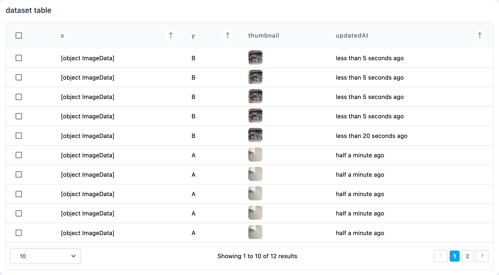

# Data displays

## datasetBrowser

```tsx
datasetBrowser(
  dataset: Dataset<InputType, string>,
  options: {
    batchSize: number;
  }): DatasetBrowser;
```

A Dataset browser provides an interface to visualize the contents of a dataset. It takes a dataset as argument, assuming that each instance contains a `thumbnail` property that can be displayed as an image (typically, a base64 dataURI).

### Parameters

| Option            | Type    | Description                                                                 | Required |
| ----------------- | ------- | --------------------------------------------------------------------------- | :------: |
| dataset           | Dataset | The dataset to visualize                                                    |    ✓     |
| options.batchSize | number  | The number of images per batch. If 0, all images are loaded. Defaults to 6. |    ✓     |

### Screenshot

<div style="background: rgb(237, 242, 247); padding: 8px; margin-top: 1rem;">
  
</div>

### Example

```js
const trainingSetBrowser = marcelle.datasetBrowser(trainingSet);
dashboard.page('Data Management').use(trainingSetBrowser);
```

## datasetTable

```tsx
datasetTable(
  dataset: Dataset,
  columns?: string[],
): DatasetTable
```

This components provides a visualization of a dataset as a paginated data table, where each row describes an instance. It takes a dataset as argument, and optionally the list of columns to display.

### Parameters

| Option  | Type     | Description                                                                                              | Required |
| ------- | -------- | -------------------------------------------------------------------------------------------------------- | :------: |
| dataset | Dataset  | The dataset to visualize                                                                                 |    ✓     |
| columns | string[] | The fields to display as columns in the visualization. Defaults to ['x', 'y', 'thumbnail', 'updatedAt']. |          |

### Screenshot

<div style="background: rgb(237, 242, 247); padding: 8px; margin-top: 1rem;">
  
</div>

### Example

```js
const tst = marcelle.datasetTable(trainingSet);
dashboard.page('Data Management').use(tst);
```

## imageDisplay

```tsx
marcelle.imageDisplay(
  imageStream: Stream<ImageData> | Stream<ImageData[]>
): DatasetBrowser;
```

An Image Display allows for displaying an image on screen provided by an input stream.

### Parameters

| Option      | Type                                         | Description                                                                                        | Required |
| ----------- | -------------------------------------------- | -------------------------------------------------------------------------------------------------- | :------: |
| imageStream | Stream\<ImageData\> \| Stream\<ImageData[]\> | Stream of images of [ImageData](https://developer.mozilla.org/en-US/docs/Web/API/ImageData) format |    ✓     |

<!-- ### Screenshot

<div style="background: rgb(237, 242, 247); padding: 8px; margin-top: 1rem;">
  
</div> -->

### Example

```js
const source = imageUpload({ width: 224, height: 224 });
const instanceViewer = marcelle.imageDisplay(source.$images);
dashboard.page('Data').use(instanceViewer);
```
