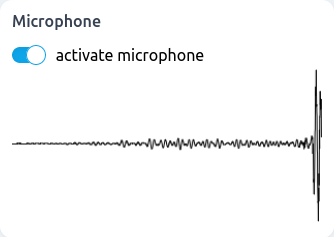

# Data sources

## mediaRecorder

```tsx
function mediaRecorder(mediaStream: MediaStream): MediaRecorder;
```

A generic recording component for audio/visual data, that works both for audio and video. The component can be used, for instance, with the microphone and webcam components.

### Parameters

| Option      | Type        | Description                      | Required | Default |
| ----------- | ----------- | -------------------------------- | :------: | :-----: |
| mediaStream | MediaStream | MediaStream from which to record |          |    0    |

The MediaStream can be obtained from the microphone and webcam component through their `mediastream` stream.

### Streams

| Name          | Type                  | Description                                                                                           | Hold |
| ------------- | --------------------- | ----------------------------------------------------------------------------------------------------- | :--: |
| \$mediaStream | Stream\<MediaStream\> | Stream of MediaStream to specify the source of recordings dynamically                                 |
| \$active      | Stream\<boolean\>     | Stream specifying the recording status, that can be used to toggle recording                          |      |
| \$recordings  | Stream\<IRecording\>  | Stream of recordings produced by the component. A new event occurs whenever the recording is stopped. |      |

Each event in the stream of recordings has the following interface:

```ts
$recordings: Stream<{
  duration: number;
  blob: Blob;
  type: string;
  thumbnail: string;
}>;
```

### Screenshot

<div style="background: rgb(237, 242, 247); padding: 8px; margin-top: 1rem;">
  
</div>

### Example

```js
const input = webcam({ audio: true }); // OR: const input = microphone();
const recorder = mediaRecorder();
recorder.$mediaStream = input.$mediastream;

recorder.$recordings.subscribe(console.log);
```

## microphone

```tsx
function microphone(): Microphone;
```

A microphone source component.

### Streams

| Name          | Type                  | Description                                                                                                       | Hold |
| ------------- | --------------------- | ----------------------------------------------------------------------------------------------------------------- | :--: |
| \$active      | Stream\<boolean\>     | Boolean stream specifying if the webcam is active (streaming)                                                     |      |
| \$ready       | Stream\<boolean\>     | Boolean stream specifying if the webcam is ready                                                                  |      |
| \$mediastream | Stream\<MediaStream\> | Stream of MediaStream corresponding to the selected microphone. Events are emitted whenever a device is selected. |      |

### Screenshot

<div style="background: rgb(237, 242, 247); padding: 8px; margin-top: 1rem;">
  
</div>

## sketchPad

```tsx
function sketchpad(): Sketchpad;
```

An input sketching component allowing the user to draw. The generate generates a stream of images of the sketches, as well as stream for various user actions.

### Streams

| Name          | Type                | Description                                                                                                                        | Hold |
| ------------- | ------------------- | ---------------------------------------------------------------------------------------------------------------------------------- | :--: |
| \$images      | Stream\<ImageData\> | Stream of images in the [ImageData](https://developer.mozilla.org/en-US/docs/Web/API/ImageData) format.                            |
| \$thumbnails  | Stream\<string\>    | Stream of thumbnail images in base64 [dataURI](https://developer.mozilla.org/en-US/docs/Web/HTTP/Basics_of_HTTP/Data_URIs) format. |      |
| \$strokeStart | Stream\<undefined\> | Stream of empty (undefined) events occurring every time the user starts drawing                                                    |      |
| \$strokeEnd   | Stream\<undefined\> | Stream of empty (undefined) events occurring every time the user stops drawing                                                     |      |

### Screenshot

<div style="background: rgb(237, 242, 247); padding: 8px; margin-top: 1rem;">
  
</div>

### Example

```js
const sketch = marcelle.sketchpad();
sketch.$strokeStart.subscribe(() => console.log('sketchpad $strokeStart'));
sketch.$strokeEnd.subscribe(() => console.log('sketchpad $strokeEnd'));
```

## webcam

```tsx
function webcam({ width?: number, height?: number, period?: number }): Webcam;
```

A webcam source component, producing a periodic stream of images.

### Parameters

| Option | Type   | Description                                  | Required | Default |
| ------ | ------ | -------------------------------------------- | :------: | :-----: |
| width  | number | The target image width                       |          |   224   |
| height | number | The target image height                      |          |   224   |
| period | number | The period in ms at which images are sampled |          |   50    |

### Streams

| Name          | Type                  | Description                                                                                                                        | Hold |
| ------------- | --------------------- | ---------------------------------------------------------------------------------------------------------------------------------- | :--: |
| \$images      | Stream\<ImageData\>   | Stream of images in the [ImageData](https://developer.mozilla.org/en-US/docs/Web/API/ImageData) format.                            |
| \$thumbnails  | Stream\<string\>      | Stream of thumbnail images in base64 [dataURI](https://developer.mozilla.org/en-US/docs/Web/HTTP/Basics_of_HTTP/Data_URIs) format. |      |
| \$active      | Stream\<boolean\>     | Boolean stream specifying if the webcam is active (streaming)                                                                      |      |
| \$ready       | Stream\<boolean\>     | Boolean stream specifying if the webcam is ready                                                                                   |      |
| \$mediastream | Stream\<MediaStream\> | Stream of MediaStream corresponding to the selected webcam. Events are emitted whenever a webcam is selected.                      |      |

### Screenshot

<div style="background: rgb(237, 242, 247); padding: 8px; margin-top: 1rem;">
  
</div>

### Example

```js
const webcam = marcelle.webcam();
webcam.$images.subscribe((x) => console.log('webcam $images:', x));
```
