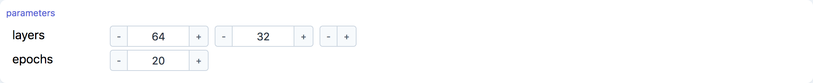
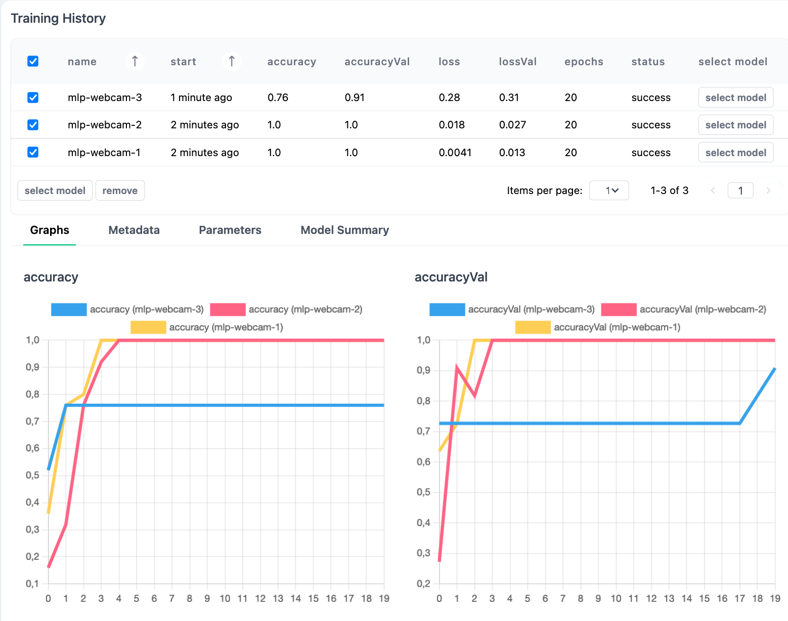

# Model interfaces

## modelParameters

```tsx
marcelle.modelParameters(p: Parametrable): ModelParameters;
```

This component provides an GUI for visualizing and adjusting parameters. It takes a `Parametrable` object as argument, which is an object (typically a model) carrying a `parameters` property which is a record of parameter streams:

```ts
interface Parametrable {
  parameters: {
    // eslint-disable-next-line @typescript-eslint/no-explicit-any
    [name: string]: Stream<any>;
  };
}
```

The component will automatically display all parameters with appropriate GUI Widgets.

### Parameters

| Option | Type         | Description                                                             | Required |
| ------ | ------------ | ----------------------------------------------------------------------- | :------: |
| p      | Parametrable | An object exposing parameters as streams to visualize and make editable |    ✓     |

### Screenshot

<div style="background: rgb(237, 242, 247); padding: 8px; margin-top: 1rem;">
  
</div>

### Example

```js
const classifier = marcelle.mlp({ layers: [64, 32], epochs: 20 });
const params = marcelle.parameters(classifier);

dashboard.page('Training').use(params);
```

## trainingProgress

```tsx
marcelle.trainingProgress(m: Model): TrainingProgress;
```

Displays the progress of the training process for a given model.

### Parameters

| Option | Type  | Description                                            | Required |
| ------ | ----- | ------------------------------------------------------ | :------: |
| m      | Model | A machine learning model exposing a `$training` stream |    ✓     |

### Screenshot

<div style="background: rgb(237, 242, 247); padding: 8px; margin-top: 1rem;">
  
</div>

### Example

```js
const classifier = marcelle.mlp({ layers: [64, 32], epochs: 20 });
const prog = marcelle.trainingProgress(classifier);
```

## trainingPlot

```tsx
marcelle.trainingPlot(m: Model): TrainingPlot;
```

Displays the training/validation loss and accuracies during the training of a neural network.

### Parameters

| Option | Type | Description                                                                                | Required |
| ------ | ---- | ------------------------------------------------------------------------------------------ | :------: |
| m      | MLP  | A neural network providing losses and accuracies in the `$training` stream during training |    ✓     |

### Screenshot

<div style="background: rgb(237, 242, 247); padding: 8px; margin-top: 1rem;">
  
</div>

### Example

```js
const classifier = marcelle.mlp({ layers: [64, 32], epochs: 20 });
const prog = marcelle.trainingPlot(classifier);
```

## trainingHistory

```tsx
marcelle.trainingHistory(dataStore: DataStore, options: {
  metrics?: string[];
  actions?: Array<string | { name: string; multiple?: boolean }>;
}): TrainingHistory;
```

The `TrainingHistory` component can be used to track and visualize training runs stored in a data store. This component is useful to compare experiments, compare model versions, and revert back to previously trained models. When using Marcelle's Python package, each training run is recorded to a data store, and can be accessed with the `TrainingHistory` component.

### Parameters

| Option          | Type                                                  | Description                                                                                                                                                                                                                                                                                                                                                                                                                                                                    | Required |
| --------------- | ----------------------------------------------------- | ------------------------------------------------------------------------------------------------------------------------------------------------------------------------------------------------------------------------------------------------------------------------------------------------------------------------------------------------------------------------------------------------------------------------------------------------------------------------------ | :------: |
| dataStore       | DataStore                                             | The [dataStore](/api/data-stores) used to store the training runs.                                                                                                                                                                                                                                                                                                                                                                                                             |    ✓     |
| options.metrics | string[]                                              | The metrics to display in the run comparison table. Defaults to ['accuracy', 'accuracyVal', 'loss', 'lossVal'].                                                                                                                                                                                                                                                                                                                                                                |    ✓     |
| options.actions | Array<string \| { name: string; multiple?: boolean }> | This option defines a set of actions that can be associated with the training runs. Actions are displayed as buttons at the end of each line in the main table and can be applied to selected runs. Actions are passed as an array of either strings (defining the name of each action) or objects (specifying the name and whether or not the action can be applied to multiple selection, i.e. several selected runs). Actions are then exposed using the `$actions` stream. |    ✓     |

### Streams

| Name        | Type                                        | Description                                                                                                                                                                            | Hold |
| ----------- | ------------------------------------------- | -------------------------------------------------------------------------------------------------------------------------------------------------------------------------------------- | :--: |
| \$selection | Stream<TrainingRun[]>                       | Stream of training runs selected through the user interface.                                                                                                                           |  ✓   |
| \$actions   | Stream<{ name: string; data: TrainingRun }> | Stream of actions triggered by the user through the associated buttons. Each event is an object containing the action's `name` and the associated training run(s) in the `data` field. |      |

Training runs and model checkpoints have the following interfaces:

```ts
export interface TrainingRun {
  id?: ObjectId;
  name: string;
  basename: string;
  start: string;
  status: TrainingStatus['status'];
  epoch?: number;
  epochs?: number;
  params?: Record<string, unknown>;
  logs?: TrainingStatus['data'];
  checkpoints?: Array<ModelCheckpoint>;
  model?: {
    summary?: string;
    [key: string]: unknown;
  };
  [key: string]: unknown;
}

export interface ModelCheckpoint {
  id: ObjectId;
  name: string;
  service: string;
  metadata?: Record<string, unknown>;
}
```

### Methods

#### .track()

```tsx
track(model: Model<InputType, OutputType>, basename = 'anonymous'): TrainingHistory
```

Start tracking a given machine learning model. Every time the model is trained, the run will be recorded to the data store and displayed in the trainingHistory component. A name `basename` can be given to the model, so that training runs are named `basename-<run index>`.

### Screenshot

<div style="background: rgb(237, 242, 247); padding: 8px; margin-top: 1rem;">
  
</div>

### Example

```js
const hist = trainingHistory(store, {
  actions: ['select model'],
}).track(classifier, 'mlp-webcam');

hist.$actions.subscribe(({ name, data }) => {
  console.log(`Action [${name}]`, data);
});
```
