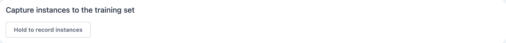
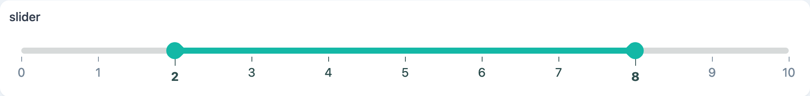
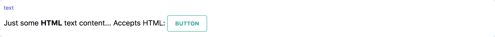
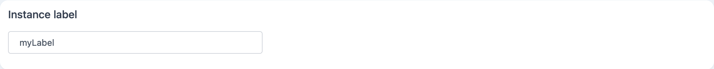
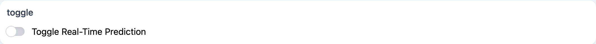

# Widgets

## button

```tsx
button(text?: string): Button;
```

A generic GUI button component.

### Parameters

| Option | Type   | Description            | Required |
| ------ | ------ | ---------------------- | :------: |
| text   | string | The text of the button |          |

### Streams

| Name       | Type                                            | Description                                                         | Hold |
| ---------- | ----------------------------------------------- | ------------------------------------------------------------------- | :--: |
| \$text     | string                                          | Stream defining the button text                                     |  ✓   |
| \$type     | 'default' \| 'success' \| 'warning' \| 'danger' | Stream defining the button type                                     |  ✓   |
| \$click    | undefined                                       | Stream of click events                                              |      |
| \$pressed  | boolean                                         | Stream of binary events indicating if the button is pressed         |  ✓   |
| \$loading  | boolean                                         | Stream of binary events indicating if the button is in loading mode |  ✓   |
| \$loading  | boolean                                         | Stream of binary events indicating if the button is in loading mode |  ✓   |
| \$disabled | boolean                                         | Stream defining if the input is disabled.                           |  ✓   |

### Screenshot

<div style="background: rgb(237, 242, 247); padding: 8px; margin-top: 1rem;">
  
</div>

### Example

```js
const capture = button('Hold to record instances');
capture.title = 'Capture instances to the training set';

capture.$click.subscribe((x) => console.log('button $click:', x));
capture.$pressed.subscribe((x) => console.log('button $pressed:', x));
```

## number

```tsx
number(defaultValue?: number): Number;
```

A generic GUI number input component.

### Parameters

| Option       | Type   | Description                   | required |
| ------------ | ------ | ----------------------------- | :------: |
| defaultValue | number | Initial value. Defaults to 0. |          |

### Streams

| Name       | Type    | Description                               | Hold |
| ---------- | ------- | ----------------------------------------- | :--: |
| \$value    | number  | Stream defining the input's value         |  ✓   |
| \$disabled | boolean | Stream defining if the input is disabled. |  ✓   |

### Screenshot

<div style="background: rgb(237, 242, 247); padding: 8px; margin-top: 1rem;">
  
</div>

### Example

```js
const epochs = number(30);
epochs.title = 'Number of Epochs';

epochs.$value.subscribe(console.log);
```

## numberArray

```tsx
numberArray(defaultValue?: number[]): NumberArray;
```

A generic GUI number array input component.

### Parameters

| Option       | Type     | Description                    | required |
| ------------ | -------- | ------------------------------ | :------: |
| defaultValue | number[] | Initial value. Defaults to []. |          |

### Streams

| Name       | Type     | Description                               | Hold |
| ---------- | -------- | ----------------------------------------- | :--: |
| \$value    | number[] | Stream defining the input's value         |  ✓   |
| \$disabled | boolean  | Stream defining if the input is disabled. |  ✓   |

### Screenshot

<div style="background: rgb(237, 242, 247); padding: 8px; margin-top: 1rem;">
  
</div>

### Example

```js
const neuronsPerLayer = numberArray([64, 32, 16]);
neuronsPerLayer.title = 'Number of Neurons per Layer';

neuronsPerLayer.$value.subscribe(console.log);
```

## select

```tsx
select(options: string[], value?: string): Select;
```

A generic GUI Select component.

### Parameters

| Option  | Type     | Description                                      | Required |
| ------- | -------- | ------------------------------------------------ | :------: |
| options | string[] | The select menu options                          |    ✓     |
| value   | string   | The default value (by default, the first option) |          |

### Streams

| Name      | Type     | Description              | Hold |
| --------- | -------- | ------------------------ | :--: |
| \$options | string[] | Stream of menu options   |  ✓   |
| \$value   | string   | Stream of selected value |  ✓   |

### Screenshot

<div style="background: rgb(237, 242, 247); padding: 8px; margin-top: 1rem;">
  
</div>

### Example

```js
const sel = select(['one', 'two', 'three'], 'two');
sel.$value.subscribe((x) => console.log('sel $value:', x));
```

## slider

```tsx
slider({
  values: number[],
  min: number,
  max: number,
  step: number,
  range: boolean | 'min' | 'max',
  float: boolean,
  vertical: boolean,
  pips: boolean,
  pipstep: number,
  formatter: (x: unknown) => unknown,
  continuous: boolean,
}): Slider;
```

A generic slider widget, allowing multiple thumbs.

### Parameters

| Option     | Type                      | Description                                                                                                                                                                                                                     | Required |  Default  |
| ---------- | ------------------------- | ------------------------------------------------------------------------------------------------------------------------------------------------------------------------------------------------------------------------------- | :------: | :-------: |
| values     | number[]                  | The default values                                                                                                                                                                                                              |          |   [0.2]   |
| min        | number                    | minimum value                                                                                                                                                                                                                   |          |     0     |
| max        | number                    | maximum value                                                                                                                                                                                                                   |          |     1     |
| step       | number                    | step size                                                                                                                                                                                                                       |          |   0.01    |
| range      | boolean \| 'min' \| 'max' | Specifies the slider bar display. If false, no bar is displayed. If true, the bar is displayed as a range between several values. If 'min' (resp. 'max'), the slider bar is displayed from the minimum (resp. 'maximum') value. |          |   'min'   |
| float      | boolean                   | specifies if the value should be displayed in a floating indicator on hover                                                                                                                                                     |          |   true    |
| vertical   | boolean                   | display the slider vertically                                                                                                                                                                                                   |          |   false   |
| pips       | boolean                   | display pips (ticks)                                                                                                                                                                                                            |          |   false   |
| pipstep    | number                    | Pip step size                                                                                                                                                                                                                   |          | undefined |
| formatter  | (x: unknown) => unknown   | The function used for formatting the pips and floating indicator                                                                                                                                                                |          | (x) => x  |
| continuous | boolean                   | Specify if values should be update continuously or on mouse release.                                                                                                                                                            |          |   true    |

### Streams

| Name     | Type   | Description              | Hold |
| -------- | ------ | ------------------------ | :--: |
| \$values | string | Stream of selected value |  ✓   |
| \$min    | string | Stream of selected value |  ✓   |
| \$max    | string | Stream of selected value |  ✓   |
| \$step   | string | Stream of selected value |  ✓   |

### Screenshot

<div style="background: rgb(237, 242, 247); padding: 8px; margin-top: 1rem;">
  
</div>

### Example

```js
const slider = slider({
  values: [2, 8],
  min: 0,
  max: 10,
  pips: true,
  step: 1,
  range: true,
});
slider.$values.subscribe((x) => console.log('slider $values:', x));
```

## text

```tsx
text(initial?: string): Text;
```

A generic GUI text display component accepting HTL strings.

### Parameters

| Option  | Type   | Description  | Required |
| ------- | ------ | ------------ | :------: |
| initial | string | Initial text |          |

### Streams

| Name    | Type    | Description                      | Hold |
| ------- | ------- | -------------------------------- | :--: |
| \$value | boolean | Stream defining the text content |      |

### Screenshot

<div style="background: rgb(237, 242, 247); padding: 8px; margin-top: 1rem;">
  
</div>

### Example

```js
const t = text(
  `Just some HTML text content...<br>
  Accepts HTML: <a href="https://marcelle.dev">Click me!</a>`,
);
```

## textInput

```tsx
textInput(defaultValue?: string): TextInput;
```

A generic GUI text input component.

### Parameters

| Option       | Type   | Description   | Required |
| ------------ | ------ | ------------- | :------: |
| defaultValue | string | Initial value |          |

### Streams

| Name       | Type    | Description                               | Hold |
| ---------- | ------- | ----------------------------------------- | :--: |
| \$value    | string  | Stream defining the input's value         |  ✓   |
| \$disabled | boolean | Stream defining if the toggle is disabled |  ✓   |

### Screenshot

<div style="background: rgb(237, 242, 247); padding: 8px; margin-top: 1rem;">
  
</div>

### Example

```js
const label = textInput('myLabel');
label.title = 'Instance label';

label.$value.subscribe(console.log);
```

## toggle

```tsx
toggle(text?: string): Toggle;
```

A generic GUI toggle (switch) component.

### Parameters

| Option | Type   | Description             | Required |
| ------ | ------ | ----------------------- | :------: |
| text   | string | The text of the togggle |          |

### Streams

| Name       | Type    | Description                               | Hold |
| ---------- | ------- | ----------------------------------------- | :--: |
| \$text     | boolean | Stream defining the toggle text           |  ✓   |
| \$checked  | boolean | Stream defining if the toggle is checked  |  ✓   |
| \$disabled | boolean | Stream defining if the toggle is disabled |  ✓   |

### Screenshot

<div style="background: rgb(237, 242, 247); padding: 8px; margin-top: 1rem;">
  
</div>

### Example

```js
const tog = toggle('Toggle Real-Time Prediction');
tog.$checked.subscribe((x) => console.log('toggle $checked:', x));
```
