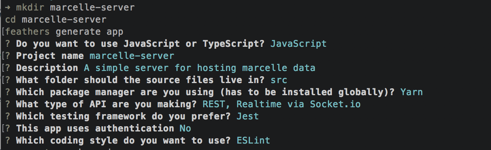
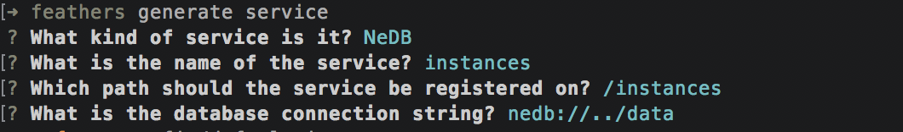

# Data Stores

Marcelle provides a flexible interface for creating _data stores_ that provide a unified interface for storing data either on the client side (in memory or using web storage) or on a remote server.
Some modules rely on the definition of a data store &ndash; for instance, the [Dataset](/api/modules/data.html#dataset) module that needs to store instances, &ndash; however data collections can be created on the fly to store custom information when relevant. This is particularly useful to store some of the state of the application (for instance the model's parameters), a history of changes to the application, or custom session logs recording some of the user's interactions.

We use the [Feathers](https://feathersjs.com/) framework to facilitate the creation of collections of heterogeneous data. When data is stored on the client side, no configuration is necessary. For remote data persistence, a server application can be generated in minutes using Feather’s command-line interface, with a large range of database systems available. The flexible selection of the data store's location is advantageous for rapid prototyping, where data is stored on the client side or using a local server during development.

## DataStore

The following factory function creates and returns a Marcelle data store:

```tsx
dataStore({ location: string }): DataStore
```

The `location` argument can either be:

- `'memory'` (default): in this case the data is stored in memory, and does not persist after page refresh
- `'localStorage'`: in this case the data is stored using the browser's web storage. It will persist after page refresh, but there is a limitation on the quantity of data that can be stored.
- a URL indicating the location of the server. The server needs to be programmed with Feathers, as described [below](#generating-a-server-application).

### .authenticate()

```tsx
async authenticate(): Promise<User>
```

### .createService()

```tsx
createService: (name: string): void;
```

Create a new service with the given `name`. If a service with the same name already exist, it will not be replaced. Note that the name of the service determines the name of the collection in the data store. It is important to choose name to avoid potential conflicts between collections.

### .login()

```tsx
async login(email: string, password: string): Promise<User>;
```

### .logout()

```tsx
async logout(): Promise<void>
```

### .service()

```tsx
service(name: string): Service<unknown>
```

Get the Feathers Service instance, which API is documented on [Feathers' wesite](https://docs.feathersjs.com/api/services.html#service-methods). The interface exposes `find`, `get`, `create`, `update`, `patch` and `remove` methods for manipulating the data.

### .signup()

```tsx
async signup(email: string, password: string): Promise<User>
```

## Generating a Server Application

::: warning TODO
Needs Update
:::

[Feather's CLI](https://docs.feathersjs.com/guides/basics/generator.html#generating-the-application) can be used to generate a Feathers server to serve as backend for your Marcelle application. For simple applications that do not require, e.g. file upload, an application can be generated without additional configuration required.

### App Generation

Let's create a new directory for our app and in it, generate a new application:

```bash
mkdir marcelle-server
cd marcelle-server
feathers generate app
```

First, choose if you want to use JavaScript or TypeScript. When presented with the project name, just hit enter, or enter a name (no spaces). Next, write a short description of your application. All other questions should be confirmed with the default selection by hitting Enter.

Once you confirm the last prompt, the final selection should look like this:



### Generating services

In our newly generated application, we can create database backed services with the following command:

```bash
feathers generate service
```

For instance, Datasets require a service named `instances`.

Feathers offers many [database adapters](https://docs.feathersjs.com/api/databases/adapters.html) including in memory, NeDB, Localstorage, MongoDB, MySQL, PostgreSQL, MariaDB, SQLite, or Elasticsearch.

For this service we will also use NeDB which we can just confirm by pressing enter. We will use `instances` as the service name and can confirm all other prompts with the defaults by pressing enter:



That's all. You now have a server ready for hosting the data capture in all datasets of your marcelle application.
