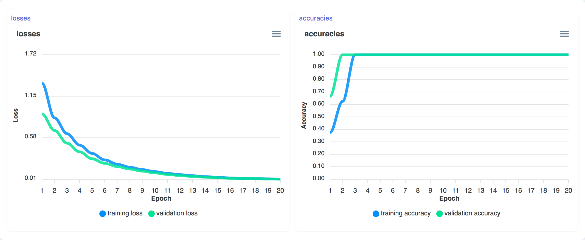

# Modules

Modules are the building blocks of a Marcelle application and handle various tasks such as capturing images from a webcam, defining a new dataset, instancing a Deep Neural Network (DNN), displaying a confusion matrix, or monitoring the confidence of a model prediction, to name a few. Because Marcelle emphasizes instant feedback and user interaction, modules often provide a graphical user interface that can be displayed on demand in a web application.

The specification of modules is somehow loose in the library, to allow for easy customization and extension. A module is essentially a JavaScript object exposing a set of reactive streams and providing a `mount` method for displaying their associated view.

All modules have string properties called `name` and `description`. The `name` is used as title for the cards displayed in a dashboard. Each module instance also carries a unique `id`.

### Member Streams

While modules have heterogeneous purposes, their unified interface makes it easy for developers to link together various parts of the processing. Marcelle relies on a reactive programming paradigm to facilitate the definition of such custom pipelines linking together the various tasks of a machine learning workflow. Each module exposes a set of data streams containing the various events produced by the module. These data streams can easily be manipulated (filtered, transformed, combined) and plugged into other modules to define pipelines.
Streams are described in more details in the [next section](/api/streams).

By convention, the streams associated with the module are members which names start with a dollar-sign, for instance:

```js
button.$click;
webcam.$images;
webcam.$thumbnails;
mlp.$training;
```

### Views

```tsx
Module.mount(targetSelector?: string): void;
```

Modules should implement a `mount` method that displays the view assotiated with the module instance. The method takes as argument a CSS selector specifying the target element where the view should be mounted. If no selector is passed, the module will attempt mounting the module on the DOM element which id is the `id` of the module.

Marcelle does not enforce the use of a particular web framework for programming views, however it uses [Svelte](https://svelte.dev/) internally, for its performance and its native compatibility with reactive data streams.

views can be destroyed using the `destroy` method of the module. Calling `destroy` will not impact the module's processing.

## Data Management and UIs

### Browser

```tsx
marcelle.browser(dataset: Dataset): Browser;
```

A Dataset browser provides an interface to visualize the contents of a dataset. It takes a dataset as argument, assuming that each instance contains a `thumbnail` property that can be displayed as an image (typically, a base64 dataURI).

#### Parameters

| Option  | Type    | Description              | Required |
| ------- | ------- | ------------------------ | :------: |
| dataset | Dataset | The dataset to visualize |    ✓     |

#### Screenshot

<div style="background: rgb(237, 242, 247); padding: 8px; margin-top: 1rem;">
  
</div>

#### Example

```js
const trainingSetBrowser = marcelle.browser(trainingSet);
dashboard.page('Data Management').use(trainingSetBrowser);
```

### Dataset

```tsx
marcelle.dataset({ name: string, backend?: Backend }): Dataset;
```

A Dataset module allowing for capturing instances from a stream, storing them in a local or remote [backend](/api/backends).

#### Parameters

| Option  | Type    | Description                                                                                                                                           | Required |
| ------- | ------- | ----------------------------------------------------------------------------------------------------------------------------------------------------- | :------: |
| name    | string  | The dataset name                                                                                                                                      |    ✓     |
| backend | Backend | The [backend](/api/backends) used to store the instances of the dataset. This parameter is optional. By default, a backend in memory will be created. |          |

#### Streams

| Name            | Type                                  | Description                                                                                | Hold |
| --------------- | ------------------------------------- | ------------------------------------------------------------------------------------------ | :--: |
| \$created       | Stream\<ObjectId\>                    | Stream of containg the ID at each newly created instance                                   |      |
| \$instances     | Stream\<ObjectId[]\>                  | Stream of all the ids of the instances contained in the dataset                            |      |
| \$classes       | Stream\<Record<string, ObjectId[]\>\> | Stream of objects associating each class label to the array of corresponding instance ids. |      |
| \$labels        | Stream\<string[]\>                    | Stream of labels currently in the dataset                                                  |      |
| \$count         | Stream\<number\>                      | Total number of instances in the dataset                                                   |      |
| \$countPerClass | Stream\<Record<string, number\>\>     | The number of instances per class                                                          |      |

#### Example

```js
const backend = marcelle.createBackend({ location: 'localStorage' });
const trainingSet = marcelle.dataset({ name: 'TrainingSet', backend });
trainingSet.capture($instances); // Capture a Stream of instances
```

## Inputs

### Faker

```tsx
marcelle.faker({ size?: number, period?: number }): Faker;
```

A module producing a synthetic data stream composed of periodic events with random vectors.

#### Parameters

| Option | Type   | Description | Required |
| ------ | ------ | ----------- | :------: |
| size   | number | Vector size |          |
| period | number | Period (ms) |          |

#### Streams

| Name     | Type               | Description             | Hold |
| -------- | ------------------ | ----------------------- | :--: |
| \$frames | Stream\<number[]\> | Stream of random events |      |

<!-- ### Screenshot

<div style="background: rgb(237, 242, 247); padding: 8px; margin-top: 1rem;">
  
</div> -->

#### Example

```js
const faker = marcelle.faker({ size: 12, period: 500 });
faker.$frames.subscribe((x) => console.log('faker $frames:', x));
```

### ImageDrop

```tsx
marcelle.imageDrop(): ImageDrop;
```

An Image drag'n'drop component, that creates a stream of images and thumbnails.

#### Streams

| Name         | Type                | Description                                                                                                                        | Hold |
| ------------ | ------------------- | ---------------------------------------------------------------------------------------------------------------------------------- | :--: |
| \$images     | Stream\<ImageData\> | Stream of images in the [ImageData](https://developer.mozilla.org/en-US/docs/Web/API/ImageData) format.                            |
| \$thumbnails | Stream\<string\>    | Stream of thumbnail images in base64 [dataURI](https://developer.mozilla.org/en-US/docs/Web/HTTP/Basics_of_HTTP/Data_URIs) format. |      |

#### Screenshot

<div style="background: rgb(237, 242, 247); padding: 8px; margin-top: 1rem;">
  
</div>

#### Example

```js
const imgDrop = marcelle.imageDrop();
imgDrop.$images.subscribe((x) => console.log('imageDrop $images:', x));
```

### Sketchpad

```tsx
marcelle.sketchpad(): Sketchpad;
```

An input sketching component allowing the user to draw. The module generates a stream of images of the sketches, as well as stream for various user actions.

#### Streams

| Name          | Type                | Description                                                                                                                        | Hold |
| ------------- | ------------------- | ---------------------------------------------------------------------------------------------------------------------------------- | :--: |
| \$images      | Stream\<ImageData\> | Stream of images in the [ImageData](https://developer.mozilla.org/en-US/docs/Web/API/ImageData) format.                            |
| \$thumbnails  | Stream\<string\>    | Stream of thumbnail images in base64 [dataURI](https://developer.mozilla.org/en-US/docs/Web/HTTP/Basics_of_HTTP/Data_URIs) format. |      |
| \$strokeStart | Stream\<undefined\> | Stream of empty (undefined) events occurring every time the user starts drawing                                                    |      |
| \$strokeEnd   | Stream\<undefined\> | Stream of empty (undefined) events occurring every time the user stops drawing                                                     |      |

#### Screenshot

<div style="background: rgb(237, 242, 247); padding: 8px; margin-top: 1rem;">
  
</div>

#### Example

```js
const sketch = marcelle.sketchpad();
sketch.$strokeStart.subscribe(() => console.log('imageDrop $strokeStart'));
sketch.$strokeEnd.subscribe(() => console.log('imageDrop $strokeEnd'));
```

### Webcam

```tsx
marcelle.webcam({ width: number, height: number }): Button;
```

A webcam source component, producing a periodic stream of images.

#### Parameters

| Option | Type   | Description             | Required |
| ------ | ------ | ----------------------- | :------: |
| width  | number | The target image width  |          |
| height | number | The target image height |          |

#### Streams

| Name          | Type                  | Description                                                                                                                        | Hold |
| ------------- | --------------------- | ---------------------------------------------------------------------------------------------------------------------------------- | :--: |
| \$images      | Stream\<ImageData\>   | Stream of images in the [ImageData](https://developer.mozilla.org/en-US/docs/Web/API/ImageData) format.                            |
| \$thumbnails  | Stream\<string\>      | Stream of thumbnail images in base64 [dataURI](https://developer.mozilla.org/en-US/docs/Web/HTTP/Basics_of_HTTP/Data_URIs) format. |      |
| \$active      | Stream\<boolean\>     | Boolean stream specifying if the webcam is active (streaming)                                                                      |      |
| \$ready       | Stream\<boolean\>     | Boolean stream specifying if the webcam is ready                                                                                   |      |
| \$mediastream | Stream\<MediaStream\> | Stream of MediaStream corresponding to the selected webcam. Events are emitted whenever a webcam is selected.                      |      |

#### Screenshot

<div style="background: rgb(237, 242, 247); padding: 8px; margin-top: 1rem;">
  
</div>

#### Example

```js
const webcam = marcelle.webcam();
webcam.$images.subscribe((x) => console.log('webcam $images:', x));
```

## Models

### CocoSSD

### KNN

```tsx
marcelle.knn({ k: number }): KNN;
```

A K-Nearest Neighbors classifier based on [Tensorflow.js's implementation](https://github.com/tensorflow/tfjs-models/tree/master/knn-classifier).

#### Parameters

| Option | Type   | Description                                                                                                                                                                                                                                                                      | Required |
| ------ | ------ | -------------------------------------------------------------------------------------------------------------------------------------------------------------------------------------------------------------------------------------------------------------------------------- | :------: |
| k      | number | The K value to use in K-nearest neighbors. The algorithm will first find the K nearest examples from those it was previously shown, and then choose the class that appears the most as the final prediction for the input example. Defaults to 3. If examples < k, k = examples. |          |

The set of reactive parameters has the following signature:

```ts
interface KNNParameters {
  k: Stream<number>;
}
```

#### Streams

| Name       | Type                     | Description                                                                                                                                                                                               | Hold |
| ---------- | ------------------------ | --------------------------------------------------------------------------------------------------------------------------------------------------------------------------------------------------------- | :--: |
| \$training | Stream\<TrainingStatus\> | Stream of training status events, containing the current status ('idle' / 'start' / 'epoch' / 'success' / 'error'), the current epoch and associated data (such as loss and accuracy) during the training |      |

Each `$training` event has the following signature:

```ts
interface TrainingStatus {
  status: 'idle' | 'start' | 'epoch' | 'success' | 'error';
  epoch?: number;
  epochs?: number;
  data?: Record<string, unknown>;
}
```

#### Methods

##### .train()

```tsx
train(dataset: Dataset): void
```

Train the model from a given dataset.

##### .clear()

```tsx
clear(): void
```

Clear the model, removing all instances

##### .predict()

```tsx
async predict(x: number[][]): Promise<KNNResults>
```

Make a prediction from an input feature array `x`. The method is asynchronous and returns a promise that resolves with the results of the prediction. The results have the following signature:

```ts
interface KNNResults {
  label: string;
  confidences: { [key: string]: number };
}
```

#### Example

```js
const classifier = marcelle.knn({ k: 5 });
classifier.train(trainingSet);

const predictionStream = $featureStream // A stream of input features
  .thru(mostCore.map(async (features) => classifier.predict(features)))
  .thru(mostCore.awaitPromises);
```

### Mobilenet

```tsx
marcelle.mobilenet({
  version?: 1 | 2,
  alpha?: 0.25 | 0.50 | 0.75 | 1.0,
}): Mobilenet;
```

The mobilenet module can be used both as a classification model and as a feature extractor. It is based on [Tensorflow.js's Mobilenet implementation](https://github.com/tensorflow/tfjs-models/tree/master/mobilenet). For feature extraction, the `.process()` method can be used to get the embeddings from an input image.

#### Parameters

| Option  | Type                        | Description                                                                                                                                                                                                                                                        | Required |
| ------- | --------------------------- | ------------------------------------------------------------------------------------------------------------------------------------------------------------------------------------------------------------------------------------------------------------------ | :------: |
| version | 1 \| 2                      | The MobileNet version number. Use 1 for [MobileNetV1](https://github.com/tensorflow/models/blob/master/research/slim/nets/mobilenet_v1.md), and 2 for [MobileNetV2](https://github.com/tensorflow/models/tree/master/research/slim/nets/mobilenet). Defaults to 1. |          |
| alpha   | 0.25 \| 0.50 \| 0.75 \| 1.0 | Controls the width of the network, trading accuracy for performance. A smaller alpha decreases accuracy and increases performance. 0.25 is only available for V1. Defaults to 1.0.                                                                                 |          |

Since parameters are used to load a heavy model, they can only be used on when the module is created, and there are not reactive parameters.

#### Methods

##### .process()

```tsx
async process(image: ImageData): Promise<number[][]>
```

Use mobilenet for feature extraction, for example to perform transfer learning. The method returns the embedding for the input image. The size of the embedding depends on the alpha (width) of the model.

##### .predict()

```tsx
async predict(image: ImageData): Promise<MobilenetResults>
```

Make a prediction from an input image `image` in ImageData format. The method is asynchronous and returns a promise that resolves with the results of the prediction. The results have the following signature:

```ts
interface MobilenetResults {
  label: string;
  confidences: { [key: string]: number };
}
```

#### Example

```js
const input = marcelle.webcam();
const m = marcelle.mobilenet();

// Extract features (embedding) from webcam images
const $embedding = input.$images
  .thru(mostCore.map((img) => m.process(img)))
  .thru(mostCore.awaitPromises);

// Predict labels from webcam images (default mobilenet classification)
const $embedding = input.$images
  .thru(mostCore.map((img) => m.predict(img)))
  .thru(mostCore.awaitPromises);
```

### MLP

```tsx
marcelle.mlp({ layers: number[], epochs: number }): MLP;
```

A Multi-Layer Perceptron using Tensorflow.js. The configuration of the model (number of layers and number of hidden nodes per layer) can be configured.

#### Parameters

| Option | Type     | Description                                                                                                              | Required |
| ------ | -------- | ------------------------------------------------------------------------------------------------------------------------ | :------: |
| layers | number[] | The model configuration as an array of numbers, where each element defines a layer with the given number of hidden nodes |          |
| epochs | number   | Number of epochs used for training                                                                                       |          |

The set of reactive parameters has the following signature:

```ts
interface MLPParameters {
  layers: Stream<number[]>;
  epochs: Stream<number>;
}
```

#### Streams

| Name       | Type                     | Description                                                                                                                                                                                               | Hold |
| ---------- | ------------------------ | --------------------------------------------------------------------------------------------------------------------------------------------------------------------------------------------------------- | :--: |
| \$training | Stream\<TrainingStatus\> | Stream of training status events, containing the current status ('idle' / 'start' / 'epoch' / 'success' / 'error'), the current epoch and associated data (such as loss and accuracy) during the training |      |

Each `$training` event has the following signature:

```ts
interface TrainingStatus {
  status: 'idle' | 'start' | 'epoch' | 'success' | 'error';
  epoch?: number;
  epochs?: number;
  data?: Record<string, unknown>;
}
```

#### Methods

##### .train()

```tsx
train(dataset: Dataset): void
```

Train the model from a given dataset.

##### .clear()

```tsx
clear(): void
```

Clear the model, removing all instances

##### .predict()

```tsx
async predict(x: number[][]): Promise<MLPResults>
```

Make a prediction from an input feature array `x`. The method is asynchronous and returns a promise that resolves with the results of the prediction. The results have the following signature:

```ts
interface MLPResults {
  label: string;
  confidences: { [key: string]: number };
}
```

#### Example

```js
const classifier = marcelle.mlp({ layers: [64, 32], epochs: 50 });
classifier.train(trainingSet);

const predictionStream = $featureStream // A stream of input features
  .thru(mostCore.map(async (features) => classifier.predict(features)))
  .thru(mostCore.awaitPromises);
```

### tfImageClassifier

## Model UIs

### Parameters

```tsx
marcelle.parameters(p: Parametrable): Parameters;
```

This module provides an automatic GUI for visualizing and adjusting parameters. It takes a `Parametrable` object as argument, which is an object (typically a model) carrying a `parameters` property which is a record of parameter streams:

```ts
interface Parametrable {
  parameters: {
    // eslint-disable-next-line @typescript-eslint/no-explicit-any
    [name: string]: Stream<any>;
  };
}
```

The module will automatically display all parameters with appropriate GUI Widgets.

#### Parameters

| Option | Type         | Description                                                             | Required |
| ------ | ------------ | ----------------------------------------------------------------------- | :------: |
| p      | Parametrable | An object exposing parameters as streams to visualize and make editable |    ✓     |

#### Screenshot

<div style="background: rgb(237, 242, 247); padding: 8px; margin-top: 1rem;">
  
</div>

#### Example

```js
const classifier = marcelle.mlp({ layers: [64, 32], epochs: 20 });
const params = marcelle.parameters(classifier);

dashboard.page('Training').use(params);
```

### Progress

```tsx
marcelle.progress(m: Model): Progress;
```

Displays the progress of the training process for a given model.

#### Parameters

| Option | Type  | Description                                            | Required |
| ------ | ----- | ------------------------------------------------------ | :------: |
| m      | Model | A machine learning model exposing a `$training` stream |    ✓     |

#### Screenshot

<div style="background: rgb(237, 242, 247); padding: 8px; margin-top: 1rem;">
  
</div>

#### Example

```js
const classifier = marcelle.mlp({ layers: [64, 32], epochs: 20 });
const prog = marcelle.progress(classifier);
```

### TrainingPlot

```tsx
marcelle.trainingPlot(m: Model): Progress;
```

Displays the training/validation loss and accuracies during the training of a neural network.

#### Parameters

| Option | Type | Description                                                                                | Required |
| ------ | ---- | ------------------------------------------------------------------------------------------ | :------: |
| m      | MLP  | A neural network providing losses and accuracies in the `$training` stream during training |    ✓     |

#### Screenshot

<div style="background: rgb(237, 242, 247); padding: 8px; margin-top: 1rem;">
  
</div>

#### Example

```js
const classifier = marcelle.mlp({ layers: [64, 32], epochs: 20 });
const prog = marcelle.trainingPlot(classifier);
```

## Predictions

### BatchPrediction

```tsx
marcelle.batchPrediction({ name: string, backend?: Backend }): BatchPrediction;
```

This module allows to compute and store batch predictions with a given model over an entire dataset. Similarly to [Datasets](/modules/data.html#dataset), the prediction results are stored in a backend passed in argument.

#### Parameters

| Option  | Type    | Description                                                                                                                                           | Required |
| ------- | ------- | ----------------------------------------------------------------------------------------------------------------------------------------------------- | :------: |
| name    | string  | The name of the predictions (for backend storage)                                                                                                     |    ✓     |
| backend | Backend | The [backend](/api/backends) used to store the instances of the dataset. This parameter is optional. By default, a backend in memory will be created. |          |

#### Streams

| Name          | Type                 | Description                                                    | Hold |
| ------------- | -------------------- | -------------------------------------------------------------- | :--: |
| \$predictions | Stream\<ObjectId[]\> | Stream of all the ids of the predictions stored in the backend |  ✓   |
| \$count       | Stream\<number\>     | Total number of predictions                                    |  ✓   |

#### Methods

##### .predict()

```tsx
async predict(model: Model, dataset: Dataset, inputField = 'features'): Promise<void>
```

Compute predictions for all instances of a given [Datasets](/modules/data.html#dataset) `dataset`, using a trained `model`. The instance field used for predictions can be specified with the `inputField` parameters, that defaults to `features`.

##### .clear()

```tsx
async clear(): Promise<void>
```

Clear all predictions from the backend, resetting the resulting streams.

#### Example

```js
const classifier = marcelle.mlp({ layers: [64, 32], epochs: 20 });

const batchMLP = marcelle.batchPrediction({ name: 'mlp', backend });

const predictButton = marcelle.button({ text: 'Update predictions' });
predictButton.$click.subscribe(async () => {
  await batchMLP.clear();
  await batchMLP.predict(classifier, trainingSet);
});
```

### Confusion

```tsx
marcelle.confusion(prediction: BatchPrediction): Confusion;
```

Displays a confusion matrix from a [BatchPrediction](#batchprediction) module.

#### Parameters

| Option     | Type            | Description                                            | Required |
| ---------- | --------------- | ------------------------------------------------------ | :------: |
| prediction | BatchPrediction | A batch prediction module storing a set of predictions |    ✓     |

#### Screenshot

<div style="background: rgb(237, 242, 247); padding: 8px; margin-top: 1rem;">
  
</div>

#### Example

```js
const batchMLP = marcelle.batchPrediction({ name: 'mlp', backend });
const confusionMatrix = marcelle.confusion(batchMLP);
```

### PredictionPlot

```tsx
marcelle.predictionPlot(predictionStream: Stream<Prediction>): PredictionPlot;
```

Plot prediction result in real-time from a reactive stream of predictions, where each event implements the following interface:

```ts
interface Prediction {
  id?: ObjectId;
  instanceId: ObjectId;
  label?: string;
  trueLabel?: string;
  confidences?: Record<string, number>;
  [key: string]: any; // eslint-disable-line @typescript-eslint/no-explicit-any
}
```

#### Parameters

| Option           | Type                 | Description                    | Required |
| ---------------- | -------------------- | ------------------------------ | :------: |
| predictionStream | Stream\<Prediction\> | a stream of Prediction objects |    ✓     |

#### Screenshot

<div style="background: rgb(237, 242, 247); padding: 8px; margin-top: 1rem;">
  
</div>

#### Example

```js
const predictionStream = $features
  .thru(mostCore.map((feat) => classifier.predict(feat)))
  .thru(mostCore.awaitPromises);

const plotResults = marcelle.predictionPlot(predictionStream);
```

### visObjectDetection

## Visualization Tools

### Chart

## Widgets

### Button

### Select

### Slider

### Text

### Textfield

### Toggle
