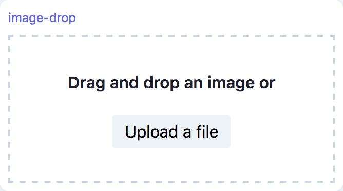

# Inputs

## ImageUpload

```tsx
marcelle.imageUpload({ width?: number, height?: number }): ImageUpload;
```

An Image upload component, that creates a stream of images and thumbnails. Images are cropped and rescaled to match the target dimensions, if these are non-zero, otherwise the dimensions are unchanged.

### Parameters

| Option | Type   | Description         | Required | Default |
| ------ | ------ | ------------------- | :------: | :-----: |
| width  | number | Target image width  |          |    0    |
| height | number | Target image height |          |    0    |

### Streams

| Name         | Type                | Description                                                                                                                        | Hold |
| ------------ | ------------------- | ---------------------------------------------------------------------------------------------------------------------------------- | :--: |
| \$images     | Stream\<ImageData\> | Stream of images in the [ImageData](https://developer.mozilla.org/en-US/docs/Web/API/ImageData) format.                            |
| \$thumbnails | Stream\<string\>    | Stream of thumbnail images in base64 [dataURI](https://developer.mozilla.org/en-US/docs/Web/HTTP/Basics_of_HTTP/Data_URIs) format. |      |

### Screenshot

<div style="background: rgb(237, 242, 247); padding: 8px; margin-top: 1rem;">
  
</div>

### Example

```js
const imgUpload = marcelle.imageUpload();
imgUpload.$images.subscribe((x) => console.log('imageUpload $images:', x));
```

## Sketchpad

```tsx
marcelle.sketchpad(): Sketchpad;
```

An input sketching component allowing the user to draw. The module generates a stream of images of the sketches, as well as stream for various user actions.

### Streams

| Name          | Type                | Description                                                                                                                        | Hold |
| ------------- | ------------------- | ---------------------------------------------------------------------------------------------------------------------------------- | :--: |
| \$images      | Stream\<ImageData\> | Stream of images in the [ImageData](https://developer.mozilla.org/en-US/docs/Web/API/ImageData) format.                            |
| \$thumbnails  | Stream\<string\>    | Stream of thumbnail images in base64 [dataURI](https://developer.mozilla.org/en-US/docs/Web/HTTP/Basics_of_HTTP/Data_URIs) format. |      |
| \$strokeStart | Stream\<undefined\> | Stream of empty (undefined) events occurring every time the user starts drawing                                                    |      |
| \$strokeEnd   | Stream\<undefined\> | Stream of empty (undefined) events occurring every time the user stops drawing                                                     |      |

### Screenshot

<div style="background: rgb(237, 242, 247); padding: 8px; margin-top: 1rem;">
  
</div>

### Example

```js
const sketch = marcelle.sketchpad();
sketch.$strokeStart.subscribe(() => console.log('sketchpad $strokeStart'));
sketch.$strokeEnd.subscribe(() => console.log('sketchpad $strokeEnd'));
```

## Webcam

```tsx
marcelle.webcam({ width?: number, height?: number, period?: number }): Webcam;
```

A webcam source component, producing a periodic stream of images.

### Parameters

| Option | Type   | Description                                  | Required | Default |
| ------ | ------ | -------------------------------------------- | :------: | :-----: |
| width  | number | The target image width                       |          |   224   |
| height | number | The target image height                      |          |   224   |
| period | number | The period in ms at which images are sampled |          |   50    |

### Streams

| Name          | Type                  | Description                                                                                                                        | Hold |
| ------------- | --------------------- | ---------------------------------------------------------------------------------------------------------------------------------- | :--: |
| \$images      | Stream\<ImageData\>   | Stream of images in the [ImageData](https://developer.mozilla.org/en-US/docs/Web/API/ImageData) format.                            |
| \$thumbnails  | Stream\<string\>      | Stream of thumbnail images in base64 [dataURI](https://developer.mozilla.org/en-US/docs/Web/HTTP/Basics_of_HTTP/Data_URIs) format. |      |
| \$active      | Stream\<boolean\>     | Boolean stream specifying if the webcam is active (streaming)                                                                      |      |
| \$ready       | Stream\<boolean\>     | Boolean stream specifying if the webcam is ready                                                                                   |      |
| \$mediastream | Stream\<MediaStream\> | Stream of MediaStream corresponding to the selected webcam. Events are emitted whenever a webcam is selected.                      |      |

### Screenshot

<div style="background: rgb(237, 242, 247); padding: 8px; margin-top: 1rem;">
  
</div>

### Example

```js
const webcam = marcelle.webcam();
webcam.$images.subscribe((x) => console.log('webcam $images:', x));
```
