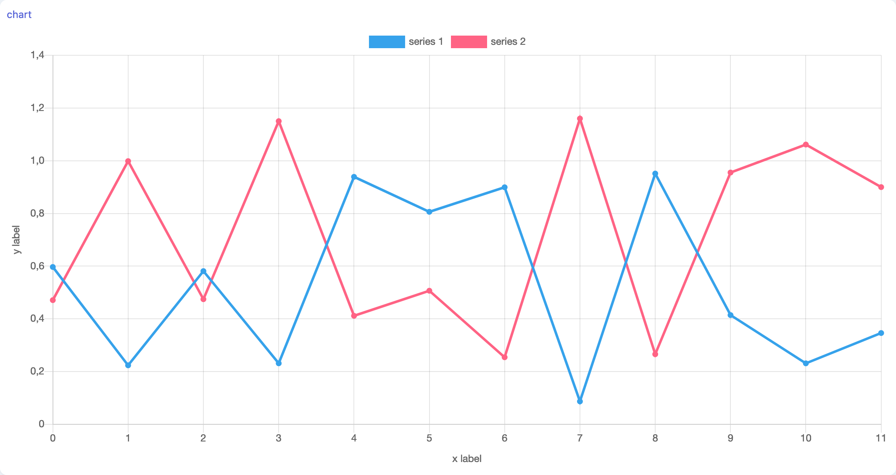

# Visualization Tools

## Chart

```tsx
chart({
  preset?: 'line' | 'line-fast' | 'bar' | 'bar-fast';
  options?: ChartOptions;
}): Chart;
```

A Charting module using the [Chart.js](#) library, to visualize data streams.

### Parameters

| Option  | Type         | Description                                                                     | Required | Default |
| ------- | ------------ | ------------------------------------------------------------------------------- | :------: | :-----: |
| preset  | string       | The chart preset. Available presets are 'line', 'line-fast', 'bar', 'bar-fast'. |          | 'line'  |
| options | ChartOptions | Custom Chart Options                                                            |          |   {}    |

Custom chart options can be passed as an object that is compatible with Chart.js's options ([see online documentation](https://www.chartjs.org/docs/next/)), with 2 additional shorthand options `xlabel` and `ylabel`.

### Screenshot

<div style="background: rgb(237, 242, 247); padding: 8px; margin-top: 1rem;">
  
</div>

### Example

```js
const series1 = marcelle
  .createStream(mostCore.periodic(500))
  .map(() => Array.from(Array(12), Math.random));
const series2 = series1.map((x) => x.map((y) => 1 - y + 0.4 * Math.random()));
const chartExample = marcelle.chart({
  options: {
    xlabel: 'x label',
    ylabel: 'y label',
  },
});
chartExample.addSeries(series1, 'series 1');
chartExample.addSeries(series2, 'series 2');
```
