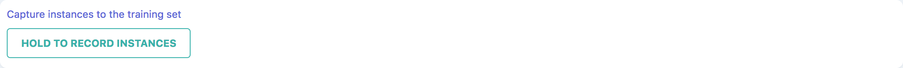
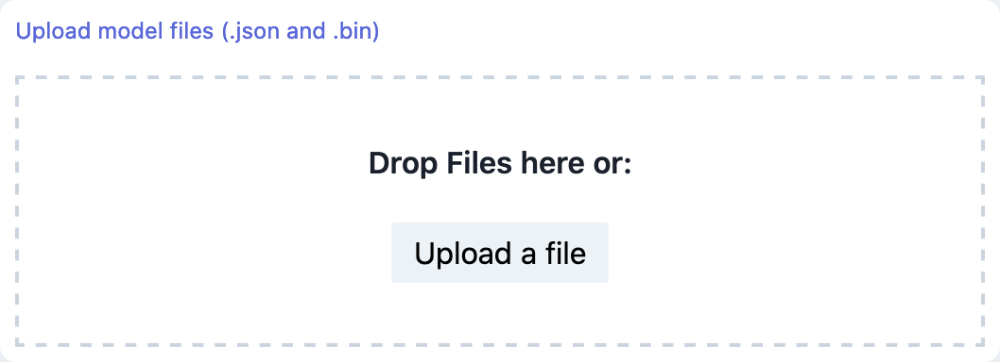
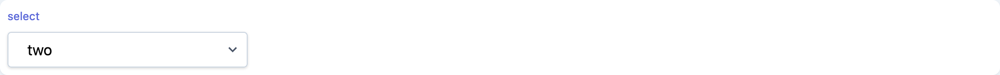

# Widgets

## Button

```tsx
marcelle.button({ text: string }): Button;
```

A generic GUI button component.

### Parameters

| Option | Type            | Description            | Required |
| ------ | --------------- | ---------------------- | :------: |
| text   | string/function | The text of the button |          |

### Streams

| Name    | Type      | Description                                                 | Hold |
| ------- | --------- | ----------------------------------------------------------- | :--: |
| \$click | undefined | Stream of click events                                      |      |
| \$down  | boolean   | Stream of binary events indicating is the button is pressed |      |
| \$text  | boolean   | Stream defining the button text                             |      |

### Screenshot

<div style="background: rgb(237, 242, 247); padding: 8px; margin-top: 1rem;">
  
</div>

### Example

```js
const capture = marcelle.button({ text: 'Hold to record instances' });
capture.name = 'Capture instances to the training set';

capture.$click.subscribe((x) => console.log('button $click:', x));
```

## FileUpload

```tsx
fileUpload(): FileUpload;
```

A generic File upload component.

### Streams

| Name    | Type   | Description                                                                                                 | Hold |
| ------- | ------ | ----------------------------------------------------------------------------------------------------------- | :--: |
| \$files | File[] | Stream of uploaded files. If several files are dropped simultaneously, stream events are an array of files. |      |

### Screenshot

<div style="background: rgb(237, 242, 247); padding: 8px; margin-top: 1rem;">
  
</div>

### Example

```js
const up = fileUpload();
up.title = 'Upload model files (.json and .bin)';

up.$files.subscribe((files) => {
  console.log('files', files);
});
```

## Select

```tsx
marcelle.select({ options: string[], value?: string }): Select;
```

A generic GUI Select component.

### Parameters

| Option  | Type     | Description                                      | Required |
| ------- | -------- | ------------------------------------------------ | :------: |
| options | string[] | The select menu options                          |    ✓     |
| value   | string   | The default value (by default, the first option) |    ✓     |

### Streams

| Name      | Type     | Description              | Hold |
| --------- | -------- | ------------------------ | :--: |
| \$options | string[] | Stream of menu options   |  ✓   |
| \$value   | string   | Stream of selected value |  ✓   |

### Screenshot

<div style="background: rgb(237, 242, 247); padding: 8px; margin-top: 1rem;">
  
</div>

### Example

```js
const sel = marcelle.select({ options: ['one', 'two', 'three'], value: 'two' });
sel.$value.subscribe((x) => console.log('sel $value:', x));
```

## Slider

```tsx
slider({
  values: number[],
  min: number,
  max: number,
  step: number,
  range: boolean | 'min' | 'max',
  float: boolean,
  vertical: boolean,
  pips: boolean,
  pipstep: number,
  formatter: (x: unknown) => unknown,
}): Slider;
```

A generic slider widget, allowing multiple thumbs.

### Parameters

| Option    | Type                      | Description                                                                                                                                                                                                                     | Required |  Default  |
| --------- | ------------------------- | ------------------------------------------------------------------------------------------------------------------------------------------------------------------------------------------------------------------------------- | :------: | :-------: |
| values    | number[]                  | The default values                                                                                                                                                                                                              |          |   [0.2]   |
| min       | number                    | minimum value                                                                                                                                                                                                                   |          |     0     |
| max       | number                    | maximum value                                                                                                                                                                                                                   |          |     1     |
| step      | number                    | step size                                                                                                                                                                                                                       |          |   0.01    |
| range     | boolean \| 'min' \| 'max' | Specifies the slider bar display. If false, no bar is displayed. If true, the bar is displayed as a range between several values. If 'min' (resp. 'max'), the slider bar is displayed from the minimum (resp. 'maximum') value. |          |   'min'   |
| float     | boolean                   | specifies if the value should be displayed in a floating indicator on hover                                                                                                                                                     |          |   true    |
| vertical  | boolean                   | display the slider vertically                                                                                                                                                                                                   |          |   false   |
| pips      | boolean                   | display pips (ticks)                                                                                                                                                                                                            |          |   false   |
| pipstep   | number                    | Pip step size                                                                                                                                                                                                                   |          | undefined |
| formatter | (x: unknown) => unknown   | The function used for formatting the pips and floating indicator                                                                                                                                                                |          | (x) => x  |

### Streams

| Name     | Type   | Description              | Hold |
| -------- | ------ | ------------------------ | :--: |
| \$values | string | Stream of selected value |  ✓   |
| \$min    | string | Stream of selected value |  ✓   |
| \$max    | string | Stream of selected value |  ✓   |
| \$step   | string | Stream of selected value |  ✓   |

### Screenshot

<div style="background: rgb(237, 242, 247); padding: 8px; margin-top: 1rem;">
  
</div>

### Example

```js
const slider = marcelle.slider({
  values: [2, 8],
  min: 0,
  max: 10,
  pips: true,
  step: 1,
  range: true,
});
slider.$values.subscribe((x) => console.log('slider $values:', x));
```

## Text

```tsx
marcelle.text({ text: string }): Text;
```

A generic GUI text display component accepting HTL strings.

### Parameters

| Option | Type            | Description             | Required |
| ------ | --------------- | ----------------------- | :------: |
| text   | string/function | The text of the togggle |          |

### Streams

| Name   | Type    | Description                      | Hold |
| ------ | ------- | -------------------------------- | :--: |
| \$text | boolean | Stream defining the text content |      |

### Screenshot

<div style="background: rgb(237, 242, 247); padding: 8px; margin-top: 1rem;">
  
</div>

### Example

```js
const t = marcelle.text({
  text:
    'Just some <strong>HTML</strong> text content... Accepts HTML: <button class="btn">button</button>',
});
```

## Textfield

```tsx
marcelle.textfield(): Textfield;
```

A generic GUI text field (input) component.

### Streams

| Name   | Type    | Description                       | Hold |
| ------ | ------- | --------------------------------- | :--: |
| \$text | boolean | Stream defining the input's value |      |

### Screenshot

<div style="background: rgb(237, 242, 247); padding: 8px; margin-top: 1rem;">
  
</div>

### Example

```js
const label = marcelle.textfield();
label.name = 'Instance label';

label.$text.subscribe(console.log);
label.$text.set('myLabel');
```

## Toggle

```tsx
marcelle.toggle({ text: string }): Toggle;
```

A generic GUI toggle (switch) component.

### Parameters

| Option | Type            | Description             | Required |
| ------ | --------------- | ----------------------- | :------: |
| text   | string/function | The text of the togggle |          |

### Streams

| Name       | Type    | Description                               | Hold |
| ---------- | ------- | ----------------------------------------- | :--: |
| \$text     | boolean | Stream defining the toggle text           |      |
| \$checked  | boolean | Stream defining if the toggle is checked  |      |
| \$disabled | boolean | Stream defining if the toggle is disabled |      |

### Screenshot

<div style="background: rgb(237, 242, 247); padding: 8px; margin-top: 1rem;">
  
</div>

### Example

```js
const tog = marcelle.toggle({ text: 'Toggle Real-Time Prediction' });
tog.$checked.subscribe((x) => console.log('toggle $checked:', x));
```
