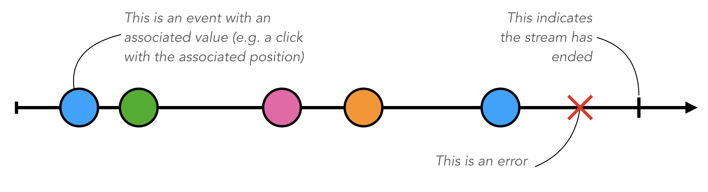

# Streams

In order to facilitate the conception of custom processing pipelines, modules rely on a reactive programming paradigm to generate or react to particular event streams. The reactive programming is well-suited for the development of such event-driven and interactive applications. It facilitates the management of asynchronous data streams, their transformation and the propagation of change to the relevant dependents.
Each module exposes a set of data streams containing the various events produced by the module. These data streams can easily be manipulated (filtered, transformed, combined) and plugged into other modules to define pipelines.

## Elements of reactive programming

From André Staltz's [The introduction to Reactive Programming you've been missing](https://gist.github.com/staltz/868e7e9bc2a7b8c1f754):

> **Reactive programming is programming with asynchronous data streams.**
>
> In a way, this isn't anything new. Event buses or your typical click events are really an asynchronous event stream, on which you can observe and do some side effects. Reactive is that idea on steroids. You are able to create data streams of anything, not just from click and hover events. Streams are cheap and ubiquitous, anything can be a stream: variables, user inputs, properties, caches, data structures, etc. For example, imagine your Twitter feed would be a data stream in the same fashion that click events are. You can listen to that stream and react accordingly.
>
> **On top of that, you are given an amazing toolbox of functions to combine, create and filter any of those streams.**
>
> That's where the "functional" magic kicks in. A stream can be used as an input to another one. Even multiple streams can be used as inputs to another stream. You can merge two streams. You can filter a stream to get another one that has only those events you are interested in. You can map data values from one stream to another new one.

Schematically, a stream looks like this:



A stream is sequence of ongoing events ordered in time. Streams can be finite or infinite. A Stream's event can be a value, an error or an end signal that indicates the streams has ended.

_Marcelle_ relies on a reactive programming library called [Most.js](https://github.com/mostjs/core).
While _RxJS_ is certainly the most popular JavaScript reactive programing library, _Most.js_ offers high performance and explicit time representation.

All _Most.js_ operators are documented online: [https://mostcore.readthedocs.io/en/latest/](https://mostcore.readthedocs.io/en/latest/)

## Stream

Marcelle's main Stream class is a wrapper around [Most.js](https://github.com/mostjs/core) streams, designed to:

- facilitate the integration with Svelte components
- allow for impartively pushing events (like RxJs's `Subject`)
- allow for holding values (like RxJs's `BehaviorSubject`)
- offer a fluent API using [@most/fluent](https://github.com/mostjs/x-fluent)

The following factory function creates and returns a Marcelle Stream from a Most.js Stream:

```tsx
createStream<T>(s: MostStream<T> | T, hold: boolean): Stream<T>
```

#### Parameters

| Option | Type                 | Description                                                                                                                                                             | Required |
| ------ | -------------------- | ----------------------------------------------------------------------------------------------------------------------------------------------------------------------- | :------: |
| s      | MostStream\<T\> \| T | A stream from the most library, or a value                                                                                                                              |    ✓     |
| hold   | boolean              | If true, the last event is stored and delivered to each new oserver. This uses [@most/hold](https://github.com/mostjs/hold), and is similar to RxJs's `BehaviorSubject` |          |

#### Example

```js
const $timer = marcelle.createStream(mostCore.periodic(500));
const $rnd = $timer
  .map(() => Math.random())
  .filter((x) => x > 0.5)
  .map((x) => (x - 0.5) * 1000));
$rnd.subscribe(console.log);
```

### .hold()

```tsx
hold(): Stream<T>
```

Hold the stream values. When called, all new subscribers will receive the latest value at the time of subscription.

### .start()

```tsx
start(): void
```

Start the stream processing, even if no subscriber has been registered. This method is called automatically on `subscribe`.

### .stop()

```tsx
stop(): void
```

Imperatively stop the stream processing. Calling `stop` will result in an `end` event being emitted on the stream.

### .subscribe()

```tsx
subscribe(run: (value: T) => void = dummySubscriber, invalidate = () => {}): () => void
```

The `subscribe` method must accept as its argument a subscription function. All of a streams's active subscription functions are synchronously called whenever a new event is emitted on the stream. If a stream is held, this subscription function must be immediately and synchronously called with the stream's current value upon calling `subscribe`.

### .thru()

```tsx
thru<B>(f: (s: Stream<T>) => MostStream<B>): Stream<B>
```

Apply functions fluently to a Stream, wrapping the result in a new Stream. Use thru when you want to continue dot-chaining other Stream operations.

### .ap()

```tsx
ap<B>(fs: Stream<(a: T) => B>): Stream<B>
```

Apply the latest function in a Stream of functions to the latest value of<br>another Stream. In effect, ap applies a time-varying function to a<br>time-varying value.

[See on Most Docs](https://mostcore.readthedocs.io/en/latest/api.html#ap)

#### Parameters

| Parameter | Type                  | Default | Description     |
| --------- | --------------------- | ------- | --------------- |
| fs        | Stream\<(a: T) => B\> |         | Function stream |

### .awaitPromises()

```tsx
awaitPromises<A>(): Stream<A>
```

Turn a Stream of promises into a Stream containing the promises’ values.

[See on Most Docs](https://mostcore.readthedocs.io/en/latest/api.html#awaitpromises)

### .chain()

```tsx
chain<B>(f: (value: T) => Stream<B>): Stream<B>
```

Transform each event in `stream` into a new Stream, and then merge each into<br>the resulting Stream. Note that `f` must return a Stream.

[See on Most Docs](https://mostcore.readthedocs.io/en/latest/api.html#chain)

#### Parameters

| Parameter | Type                      | Default | Description                 |
| --------- | ------------------------- | ------- | --------------------------- |
| f         | (value: T) => Stream\<B\> |         | function returning a stream |

### .combine()

```tsx
combine<A, R>(f: (a: A, b: T) => R, stream1: Stream<A>): Stream<R>
```

Apply a function to the most recent event from each Stream when a new event<br>arrives on any Stream.Note that `combine` waits for at least one event to arrive on all input<br>Streams before it produces any events.

[See on Most Docs](https://mostcore.readthedocs.io/en/latest/api.html#combine)

#### Parameters

| Parameter | Type              | Default | Description         |
| --------- | ----------------- | ------- | ------------------- |
| f         | (a: A, b: T) => R |         | Combinator function |
| stream1   | Stream\<A\>       |         | Event stream 1      |

### .concatMap()

```tsx
concatMap<B>(f: (a: T) => Stream<B>): Stream<B>
```

Transform each event in `stream` into a Stream, and then concatenate each<br>onto the end of the resulting Stream. Note that `f` must return a Stream.The mapping function `f` is applied lazily. That is, `f` is called only once<br>it is time to concatenate a new stream.

[See on Most Docs](https://mostcore.readthedocs.io/en/latest/api.html#concatmap)

#### Parameters

| Parameter | Type                  | Default | Description                 |
| --------- | --------------------- | ------- | --------------------------- |
| f         | (a: T) => Stream\<B\> |         | Function returning a stream |

### .constant()

```tsx
constant<B>(x: B): Stream<B>
```

Replace each event value with x.

[See on Most Docs](https://mostcore.readthedocs.io/en/latest/api.html#constant)

#### Parameters

| Parameter | Type | Default | Description |
| --------- | ---- | ------- | ----------- |
| x         | B    |         | event data  |

### .continueWith()

```tsx
continueWith<U>(f: () => Stream<U>): Stream<T | U>
```

Replace the end of a Stream with another Stream. When `stream` ends, `f`<br>will be called and must return a Stream.

[See on Most Docs](https://mostcore.readthedocs.io/en/latest/api.html?highlight=continuewith#continuewith)

#### Parameters

| Parameter | Type              | Default | Description                    |
| --------- | ----------------- | ------- | ------------------------------ |
| f         | () => Stream\<U\> |         | Function that returns a stream |

### .debounce()

```tsx
debounce(period: number): Stream<T>
```

Wait for a burst of events to subside and keep only the last event in the<br>burst.If the Stream ends while there is a pending debounced event (e.g., via<br>until), the pending event will occur just before the Stream ends.

[See on Most Docs](https://mostcore.readthedocs.io/en/latest/api.html#debounce)

#### Parameters

| Parameter | Type   | Default | Description     |
| --------- | ------ | ------- | --------------- |
| period    | number |         | Debounce period |

### .delay()

```tsx
delay(delayTime: number): Stream<T>
```

Timeshift a Stream by the specified Delay.

[See on Most Docs](https://mostcore.readthedocs.io/en/latest/api.html#id57)

#### Parameters

| Parameter | Type   | Default | Description     |
| --------- | ------ | ------- | --------------- |
| delayTime | number |         | Delay time (ms) |

### .during()

```tsx
during(timeWindow: Stream<Stream<unknown>>): Stream<T>
```

Keep events that occur during a time window defined by a higher-order Stream.

#### Parameters

| Parameter  | Type                        | Default | Description                                |
| ---------- | --------------------------- | ------- | ------------------------------------------ |
| timeWindow | Stream\<Stream\<unknown\>\> |         | Higher order stream defining a time window |

### .filter()

```tsx
filter(p: (a: T) => boolean): Stream<T>
```

Retain only events for which a predicate is truthy.

[See on Most Docs](https://mostcore.readthedocs.io/en/latest/api.html#filter)

#### Parameters

| Parameter | Type              | Default | Description |
| --------- | ----------------- | ------- | ----------- |
| p         | (a: T) => boolean |         | Predicate   |

#### Example

```js
a = periodic(200)
  .rand()
  .filter((x) => x > 0.8)
  .tap(log);
```

### .join()

```tsx
join<U>(): Stream<U>
```

Given a higher-order Stream, return a new Stream that merges all the inner<br>Streams as they arrive.

[See on Most Docs](https://mostcore.readthedocs.io/en/latest/api.html#join)

### .loop()

```tsx
loop<B, S>(stepper: (seed: S, a: T) => SeedValue<S, B>, seed: S): Stream<B>
```

Accumulate results using a feedback loop that emits one value and feeds back<br>another to be used in the next iteration.It allows you to maintain and update a “state” (a.k.a. feedback, a.k.a. seed<br>for the next iteration) while emitting a different value. In contrast, scan<br>feeds back and produces the same value.

[See on Most Docs](https://mostcore.readthedocs.io/en/latest/api.html#loop)

#### Parameters

| Parameter | Type                                 | Default | Description      |
| --------- | ------------------------------------ | ------- | ---------------- |
| stepper   | (seed: S, a: T) => SeedValue\<S, B\> |         | Stepper function |
| seed      | S                                    |         | Seed             |

### .map()

```tsx
map<U>(f: (a: T) => U): Stream<U>
```

Apply a function to each event value.

[See on Most Docs](https://mostcore.readthedocs.io/en/latest/api.html#map)

#### Parameters

| Parameter | Type        | Default | Description    |
| --------- | ----------- | ------- | -------------- |
| f         | (a: T) => U |         | Unary function |

#### Example

```js
// Apply a function (in this example, double) to all events in a stream
f = (x) => 2 * x;
a = periodic(500).constant(1).accum().map(f).tap(log);
```

### .merge()

```tsx
merge<A>(stream1: Stream<A>): Stream<A | T>
```

Create a new Stream containing events from two Streams.Merging creates a new Stream containing all events from the two original<br>Streams without affecting the time of the events. You can think of the<br>events from the input Streams simply being interleaved into the new, merged<br>Stream. A merged Stream ends when all of its input Streams have ended.

[See on Most Docs](https://mostcore.readthedocs.io/en/latest/api.html#merge)

#### Parameters

| Parameter | Type        | Default | Description    |
| --------- | ----------- | ------- | -------------- |
| stream1   | Stream\<A\> |         | Event stream 1 |

#### Example

```js
a = periodic(500).take(3).constant('a');
b = periodic(100).take(3).constant(2);
c = a.merge(b).tap(log);
```

### .mergeConcurrently()

```tsx
mergeConcurrently<U>(concurrency: number): Stream<U>
```

Given a higher-order Stream, return a new Stream that merges inner Streams<br>as they arrive up to the specified concurrency. Once concurrency number of<br>Streams are being merged, newly arriving Streams will be merged after an<br>existing one ends.

[See on Most Docs](https://mostcore.readthedocs.io/en/latest/api.html#mergeconcurrently)

#### Parameters

| Parameter   | Type   | Default | Description       |
| ----------- | ------ | ------- | ----------------- |
| concurrency | number |         | concurrency level |

### .mergeMapConcurrently()

```tsx
mergeMapConcurrently<B>(f: (a: T) => Stream<B>, concurrency: number): Stream<B>
```

Lazily apply a function `f` to each event in a Stream, merging them into the<br>resulting Stream at the specified concurrency. Once concurrency number of<br>Streams are being merged, newly arriving Streams will be merged after an<br>existing one ends.

[See on Most Docs](https://mostcore.readthedocs.io/en/latest/api.html#mergemapconcurrently)

#### Parameters

| Parameter   | Type                  | Default | Description       |
| ----------- | --------------------- | ------- | ----------------- |
| f           | (a: T) => Stream\<B\> |         | Unary function    |
| concurrency | number                |         | concurrency level |

### .recoverWith()

```tsx
recoverWith<A, E extends Error>(f: (error: E) => Stream<A>): Stream<T | A>
```

Recover from a stream failure by calling a function to create a new Stream.

[See on Most Docs](https://mostcore.readthedocs.io/en/latest/api.html#recoverwith)

#### Parameters

| Parameter | Type                      | Default | Description                                   |
| --------- | ------------------------- | ------- | --------------------------------------------- |
| f         | (error: E) => Stream\<A\> |         | Function returning a new stream from an error |

### .resample()

```tsx
resample<B>(sampler: Stream<B>): Stream<T>
```

Like `sample`, but the value stream and sampler streams are switched

[See on Most Docs](https://mostcore.readthedocs.io/en/latest/api.html#sample)

#### Parameters

| Parameter | Type        | Default | Description    |
| --------- | ----------- | ------- | -------------- |
| sampler   | Stream\<B\> |         | Sampler stream |

#### Example

```js
// Sample a noise signal from a stream of click events
noise = periodic(20).rand().plot({ legend: 'noise' });
click = noise.resample(click(doc)).tap(log);
```

### .sample()

```tsx
sample<A>(values: Stream<A>): Stream<A>
```

For each event in the current Stream, replace the event value with the latest<br>value in another Stream. The resulting Stream will contain the same number<br>of events as the sampler Stream.

[See on Most Docs](https://mostcore.readthedocs.io/en/latest/api.html#sample)

#### Parameters

| Parameter | Type        | Default | Description  |
| --------- | ----------- | ------- | ------------ |
| values    | Stream\<A\> |         | value stream |

#### Example

```js
// Sample a noise signal from a stream of click events
noise = periodic(20).rand().plot({ legend: 'noise' });
click = click(doc).sample(noise).tap(log);
```

### .scan()

```tsx
scan<B>(f: (b: B, a: T) => B, initial: B): Stream<B>
```

Incrementally accumulate results, starting with the provided initial value.

[See on Most Docs](https://mostcore.readthedocs.io/en/latest/api.html#scan)

#### Parameters

| Parameter | Type              | Default | Description      |
| --------- | ----------------- | ------- | ---------------- |
| f         | (b: B, a: T) => B |         | Scanning reducer |
| initial   | B                 |         | Initial Value    |

#### Example

```js
// Accumulate the values of a constant stream
a = periodic(500)
  .constant(2)
  .scan((s, x) => s + x, 0)
  .tap(log);
```

### .since()

```tsx
since(startSignal: Stream<unknown>): Stream<T>
```

Discard all events in one Stream until the first event occurs in another.

[See on Most Docs](https://mostcore.readthedocs.io/en/latest/api.html#since)

#### Parameters

| Parameter   | Type              | Default | Description  |
| ----------- | ----------------- | ------- | ------------ |
| startSignal | Stream\<unknown\> |         | Start signal |

### .skip()

```tsx
skip(n: number): Stream<T>
```

Discard the first n events from stream.

[See on Most Docs](https://mostcore.readthedocs.io/en/latest/api.html#skip)

#### Parameters

| Parameter | Type   | Default | Description      |
| --------- | ------ | ------- | ---------------- |
| n         | number |         | Number of events |

### .skipAfter()

```tsx
skipAfter(p: (a: T) => boolean): Stream<T>
```

Discard all events after the first event for which predicate returns true.

[See on Most Docs](https://mostcore.readthedocs.io/en/latest/api.html#skipafter)

#### Parameters

| Parameter | Type              | Default | Description |
| --------- | ----------------- | ------- | ----------- |
| p         | (a: T) => boolean |         | Predicate   |

### .skipRepeats()

```tsx
skipRepeats(): Stream<T>
```

Remove adjacent repeated events.

[See on Most Docs](https://mostcore.readthedocs.io/en/latest/api.html#skiprepeats)

### .skipRepeatsWith()

```tsx
skipRepeatsWith(equals: (a1: T, a2: T) => boolean): Stream<T>
```

Remove adjacent repeated events, using the provided equality function to<br>compare adjacent events.

[See on Most Docs](https://mostcore.readthedocs.io/en/latest/api.html#skiprepeatswith)

#### Parameters

| Parameter | Type                      | Default | Description       |
| --------- | ------------------------- | ------- | ----------------- |
| equals    | (a1: T, a2: T) => boolean |         | Equality function |

### .skipWhile()

```tsx
skipWhile(p: (a: T) => boolean): Stream<T>
```

Discard all events until predicate returns `false`, and keep the rest.

[See on Most Docs](https://mostcore.readthedocs.io/en/latest/api.html#skipwhile)

#### Parameters

| Parameter | Type              | Default | Description |
| --------- | ----------------- | ------- | ----------- |
| p         | (a: T) => boolean |         | Predicate   |

### .slice()

```tsx
slice(start: number, end: number): Stream<T>
```

Keep only events in a range, where start <= index < end, and index is the<br>ordinal index of an event in `stream`.

[See on Most Docs](https://mostcore.readthedocs.io/en/latest/api.html#id48)

#### Parameters

| Parameter | Type   | Default | Description |
| --------- | ------ | ------- | ----------- |
| start     | number |         | start index |
| end       | number |         | end index   |

### .snapshot()

```tsx
snapshot<A, C>(f: (a: A, b: T) => C, values: Stream<A>): Stream<C>
```

For each event in a sampler Stream, apply a function to combine its value<br>with the most recent event value in another Stream. The resulting Stream<br>will contain the same number of events as the sampler Stream.

[See on Most Docs](https://mostcore.readthedocs.io/en/latest/api.html#snapshot)

#### Parameters

| Parameter | Type              | Default | Description       |
| --------- | ----------------- | ------- | ----------------- |
| f         | (a: A, b: T) => C |         | Snapshot function |
| values    | Stream\<A\>       |         | Value stream      |

### .startWith()

```tsx
startWith(x: T): Stream<T>
```

Prepend an event at time 0.

[See on Most Docs](https://mostcore.readthedocs.io/en/latest/api.html#startwith)

#### Parameters

| Parameter | Type | Default | Description |
| --------- | ---- | ------- | ----------- |
| x         | T    |         | Event data  |

### .switchLatest()

```tsx
switchLatest<U>(): Stream<U>
```

Given a higher-order Stream, return a new Stream that adopts the behavior of<br>(i.e., emits the events of) the most recent inner Stream.

[See on Most Docs](https://mostcore.readthedocs.io/en/latest/api.html#switchlatest)

### .take()

```tsx
take(n: number): Stream<T>
```

Keep at most the first n events from `stream`.

[See on Most Docs](https://mostcore.readthedocs.io/en/latest/api.html#take)

#### Parameters

| Parameter | Type   | Default | Description      |
| --------- | ------ | ------- | ---------------- |
| n         | number |         | Number of events |

### .takeWhile()

```tsx
takeWhile(p: (a: T) => boolean): Stream<T>
```

Keep all events until predicate returns `false`, and discard the rest.

[See on Most Docs](https://mostcore.readthedocs.io/en/latest/api.html#takewhile)

#### Parameters

| Parameter | Type              | Default | Description |
| --------- | ----------------- | ------- | ----------- |
| p         | (a: T) => boolean |         | Predicate   |

### .tap()

```tsx
tap(f: (a: T) => void): Stream<T>
```

Perform a side effect for each event in a Stream. For each event in stream,<br>`f` is called, but the value of its result is ignored. If `f` fails (i.e.,<br>throws an error), then the returned Stream will also fail. The Stream<br>returned by tap will contain the same events as the original Stream.

[See on Most Docs](https://mostcore.readthedocs.io/en/latest/api.html#tap)

#### Parameters

| Parameter | Type           | Default | Description  |
| --------- | -------------- | ------- | ------------ |
| f         | (a: T) => void |         | Tap function |

#### Example

```js
// Apply a function with side effects, to log the values to the console
a = periodic(500).rand().tap(log);
```

### .throttle()

```tsx
throttle(period: number): Stream<T>
```

Limit the rate of events by suppressing events that occur too often

[See on Most Docs](https://mostcore.readthedocs.io/en/latest/api.html#throttle)

#### Parameters

| Parameter | Type   | Default | Description     |
| --------- | ------ | ------- | --------------- |
| period    | number |         | Throttle period |

### .until()

```tsx
until(endSignal: Stream<unknown>): Stream<T>
```

Keep all events in one Stream until the first event occurs in another.

[See on Most Docs](https://mostcore.readthedocs.io/en/latest/api.html#until)

#### Parameters

| Parameter | Type              | Default | Description |
| --------- | ----------------- | ------- | ----------- |
| endSignal | Stream\<unknown\> |         | End signal  |

### .withItems()

```tsx
withItems<A>(items: A[]): Stream<A>
```

Replace each event value with the array item at the respective index. The<br>resulting Stream will contain the same number of events as the input Stream,<br>or array.length events, whichever is less.

[See on Most Docs](https://mostcore.readthedocs.io/en/latest/api.html#withitems)

#### Parameters

| Parameter | Type | Default | Description |
| --------- | ---- | ------- | ----------- |
| items     | A[]  |         | Items array |

### .withLocalTime()

```tsx
withLocalTime(origin: Time): Stream<T>
```

Create a Stream with localized Time values, whose origin (i.e., time 0) is<br>at the specified Time on the Scheduler provided when the Stream is observed<br>with runEffects or run.When implementing custom higher-order Stream combinators, such as chain, you<br>should use `withLocalTime` to localize “inner” Streams before running them.

[See on Most Docs](https://mostcore.readthedocs.io/en/latest/api.html#withlocaltime)

#### Parameters

| Parameter | Type | Default | Description       |
| --------- | ---- | ------- | ----------------- |
| origin    | Time |         | origin time value |

### .zip()

```tsx
zip<A, R>(f: (a: A, b: T) => R, stream1: Stream<A>): Stream<R>
```

Apply a function to corresponding pairs of events from the inputs Streams.

[See on Most Docs](https://mostcore.readthedocs.io/en/latest/api.html#zip)

#### Parameters

| Parameter | Type              | Default | Description         |
| --------- | ----------------- | ------- | ------------------- |
| f         | (a: A, b: T) => R |         | Combinator function |
| stream1   | Stream\<A\>       |         | Event stream 1      |

### .zipItems()

```tsx
zipItems<A, C>(f: (a: A, b: T) => C, items: A[]): Stream<C>
```

Apply a function to the latest event and the array value at the respective<br>index. The resulting Stream will contain the same number of events as the<br>input Stream, or array.length events, whichever is less.

[See on Most Docs](https://mostcore.readthedocs.io/en/latest/api.html#zipitems)

#### Parameters

| Parameter | Type              | Default | Description         |
| --------- | ----------------- | ------- | ------------------- |
| f         | (a: A, b: T) => C |         | Combinator function |
| items     | A[]               |         | Items               |

## Stream sources (static methods)

### empty()

```tsx
static empty(): Stream<never>
```

Create a Stream containing no events and ends immediately.

[See on Most Docs](https://mostcore.readthedocs.io/en/latest/api.html#empty)

### never()

```tsx
static never(): Stream<never>
```

Create a Stream containing no events and never ends.

[See on Most Docs](https://mostcore.readthedocs.io/en/latest/api.html#never)

### now()

```tsx
static now<A>(x: A): Stream<A>
```

Create a Stream containing a single event at time 0.

[See on Most Docs](https://mostcore.readthedocs.io/en/latest/api.html#now)

#### Parameters

| Parameter | Type | Default | Description |
| --------- | ---- | ------- | ----------- |
| x         | A    |         | event value |

### at()

```tsx
static at<A>(t: Time, x: A): Stream<A>
```

Create a Stream containing a single event at a specific time.

[See on Most Docs](https://mostcore.readthedocs.io/en/latest/api.html#at)

#### Parameters

| Parameter | Type | Default | Description     |
| --------- | ---- | ------- | --------------- |
| t         | Time |         | event time (ms) |
| x         | A    |         | event value     |

### periodic()

```tsx
static periodic(period: number): Stream<void>
```

Create an infinite Stream containing events that occur at a specified Period. The first event occurs at time 0, and the event values are `undefined`.

[See on Most Docs](https://mostcore.readthedocs.io/en/latest/api.html#periodic)

#### Parameters

| Parameter | Type   | Default | Description        |
| --------- | ------ | ------- | ------------------ |
| period    | number |         | stream period (ms) |

#### Example

```js
const myPeriodicRandomStream = Stream.periodic(500)
  .map(() => Math.random())
  .subscribe(console.log);
```

### throwError()

```tsx
static throwError(e: Error): Stream<never>
```

Create a Stream that fails with the provided `Error` at time 0. This can be useful for functions that need to return a Stream and also need to propagate an error.

[See on Most Docs](https://mostcore.readthedocs.io/en/latest/api.html#throwerror)

#### Parameters

| Parameter | Type  | Default | Description |
| --------- | ----- | ------- | ----------- |
| e         | Error |         | error       |
