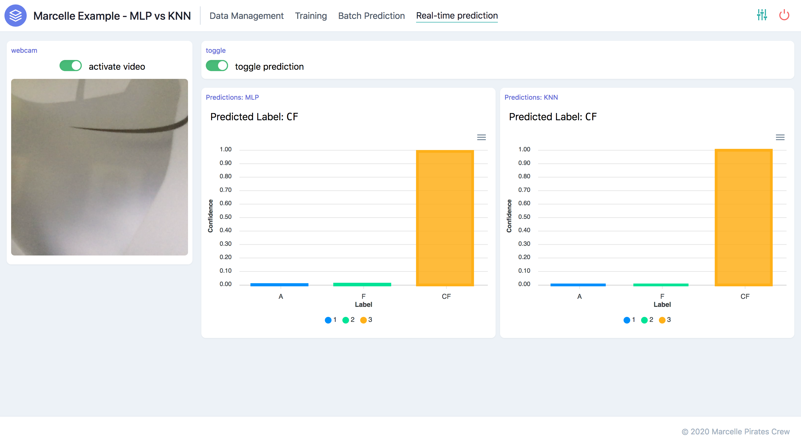
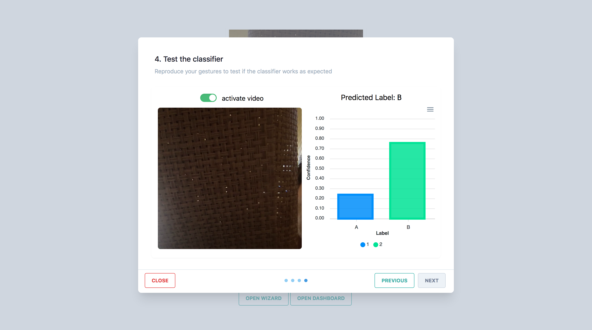
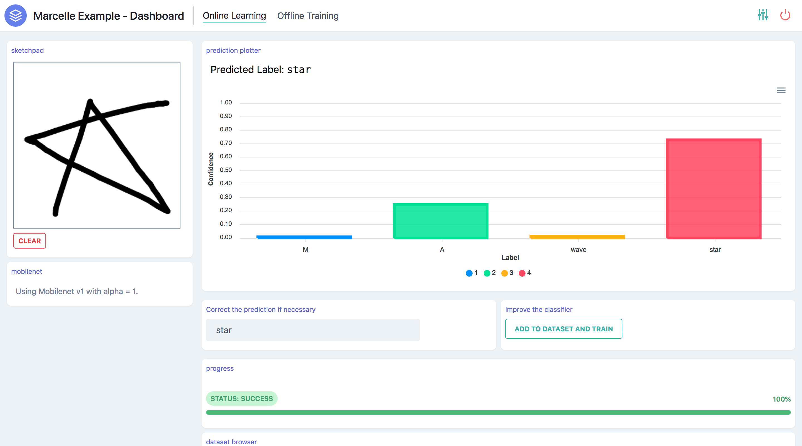

# Examples

A few examples are available on [Glitch.com](https://glitch.com/@marcelle.crew/marcelle-examples). More advanced examples using Rollup, Webpack, or with custom modules are available with the source code on [Github](https://github.com/marcellejs/marcelle-next).

## Basic dashboard

A project implementing a simple image classifier using Mobilenet embeddings for feature extraction and a Multilayer perceptron for classification. The application allows you to record examples, train the model and test its performance, and play with real-time image classification.

[Edit on Glitch](https://glitch.com/~marcelle-v2-dashboard)

## Model comparison

[Edit on Glitch](https://glitch.com/~marcelle-v2-mlp-vs-knn)

## Wizard

[Edit on Glitch](https://glitch.com/~marcelle-v2-wizard)

## Sketching

[Edit on Glitch](https://glitch.com/~marcelle-v2-sketch)

## Model Testing

[Edit on Glitch](https://glitch.com/~marcelle-v2-testing)
