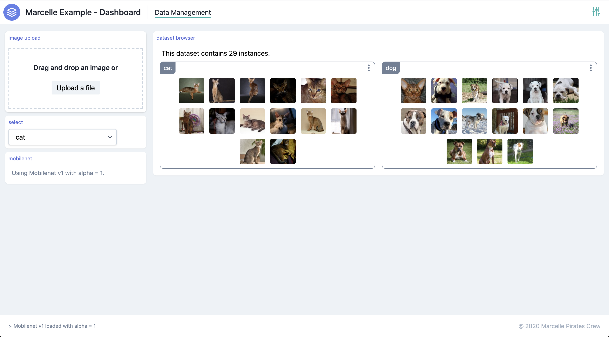
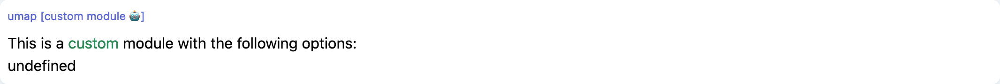
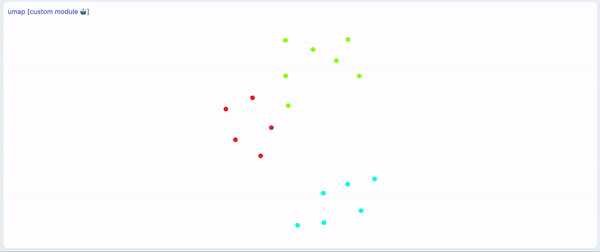

# Creating Modules

Marcelle can be extended using custom modules, that can be created locally in an application.

In this tutorial, we will create a custom module for the visualization of datasets using Uniform Manifold Approximation and Projection (UMAP). UMAP is a dimension reduction technique that can be used for visualisation similarly to t-SNE, but also for general non-linear dimension reduction.

Here is what the final application looks like (try it on [demos.marcelle.dev](https://demos.marcelle.dev/umap/)):


The details for the underlying mathematics can be found in the [following paper on ArXiv](https://arxiv.org/abs/1802.03426):

> McInnes, L, Healy, J, _UMAP: Uniform Manifold Approximation and Projection for Dimension Reduction_, ArXiv e-prints 1802.03426, 2018

## Generating the application

Let's start by generating a new Marcelle application using the CLI:

```bash
mkdir marcelle-umap
cd marcelle-umap
marcelle generate app
```

Select the default options of the CLI. Then, make sure the application works by running the development server:

```bash
npm run dev
```

And open [http://localhost:8080](http://localhost:8080) in your browser.

Then, update the main application entry point (`src/index.js`) with the application skeleton:

::: details src/index.js

````js
import '@marcellejs/core/dist/marcelle.css';
import {
  datasetBrowser,
  mobilenet,
  dataset,
  button,
  dataStore,
  dashboard,
  text,
  imageUpload,
  textfield,
} from '@marcellejs/core';
import { umap } from './modules';

// -----------------------------------------------------------
// INPUT PIPELINE & DATA CAPTURE
// -----------------------------------------------------------

const input = imageUpload({ width: 224, height: 224 });
const featureExtractor = mobilenet();

const label = textfield({ text: 'cat' });
label.title = 'Label (to record in the dataset)';

const instances = input.$images
  .map(async (img) => ({
    type: 'image',
    data: img,
    label: label.$text.value,
    thumbnail: input.$thumbnails.value,
    features: await featureExtractor.process(img),
  }))
  .awaitPromises();

const store = dataStore({ location: 'localStorage' });
const trainingSet = dataset({ name: 'TrainingSet', dataStore: store });
trainingSet.capture(instances);

const trainingSetBrowser = datasetBrowser(trainingSet);

const trainingSetUmap = umap(trainingSet);

const updateUMap = button({ text: 'Update Visualization' });
updateUMap.$click.subscribe(() => {
  trainingSetUmap.update();
});

const selectedInstance = trainingSetUmap.$selected
  .filter((x) => x.length === 1)
  .map((id) => trainingSet.getInstance(id))
  .awaitPromises();

const img = text();
selectedInstance.subscribe((instance) => {
  img.$text.set(``);
});

// -----------------------------------------------------------
// DASHBOARDS
// -----------------------------------------------------------

const dash = dashboard({
  title: 'Marcelle Example - Dashboard',
  author: 'Marcelle Pirates Crew',
});

dash.page('Data Management')
  .useLeft(input, label, featureExtractor)
  .use(trainingSetBrowser);
dash.settings.datasets(trainingSet);

dash.start();
:::

The application's input is an image upload component, and images are preprocessed using the pretrained neural network Mobilenet. Training data can be captured to a dataset called `TrainingSet`.
You can download the data [here](/cats-dogs.zip). Unzip the folder, then in the Marcelle application:
- Select 'cat' in the menu and drop all cat images
- Select 'dog' in the menu and drop all dog images

You should obtain the following application:



## Generating a Module

Modules are essentially JavaScript objects exposing a set of streams for communicating with other Marcelle modules, and optionally providing a view. The easiest way to generate a new module is using the CLI:

```bash
marcelle generate module
````

Choosing the name `umap`, the CLI will generate the following files:


- `src/modules/umap/umap.module.js` contains the main module class definition
- `src/modules/umap/umap.svelte` is a [Svelte](https://svelte.dev/) component defining our module's view
- `src/modules/umap/index.js` is used to export a constructor function for the module

The generated module is already functional. Let's start by displaying it in our application. Edit `src/index.js` to import the module, create a new instance, and display it in the dashboard:

```js{5,11,18}
import '@marcellejs/core/dist/bundle.css';
import {
  ...
} from '@marcellejs/core';
import { umap } from './modules';

// ...

const trainingSetBrowser = datasetBrowser(trainingSet);

const trainingSetUmap = umap();

// ...

dash
  .page('Data Management')
  .useLeft(input, featureExtractor)
  .use([label, capture], trainingSetBrowser, trainingSetUmap);
dash.settings.use(trainingSet);

dash.start();
```

You should see the custom module appear in the dashboard:

<div style="background: rgb(237, 242, 247); padding: 8px; margin-top: 1rem;">
  
</div>

## Anatomy of a module

Let's inspect what constitutes a module. A module is composed of three files

- `src/modules/umap/umap.module.js` contains the main module class definition
- `src/modules/umap/umap.svelte` is a [Svelte](https://svelte.dev/) component defining our module's view
- `src/modules/umap/index.js` is used to export a constructor function for the module

The main module definition is a class in `umap.module.js`:

```js
// Our custom UMAP module extends the base class "Module"
export class Umap extends Module {
  constructor(options) {
    super();
    this.title = 'umap [custom module 🤖]';
    this.options = options;
  }

  // Module methods
}
```

The constructor specifies the module's `title`, which is displayed when a module is added to the dashboard. Additionally, we can pass parameters to the module's constructor. In this case, the module accepts an arbitrary object of options.

Let's try passing options to the module. In the main script, update the instanciation of the module:

```js
const trainingSetUmap = umap({ someParam: 'Yes', other: 33 });
```

The list of parameters should be displayed in the module view on the dashboard. Module views are created using the module's `.mount()` method. This method can either be called manually by the user, or automatically if the module is added to a dashboard's page. The `mount` method optionally takes a HTML element where the module should be displayed. If no target element is specified, the module will be mounted on the element with `id` corresponding to the module's unique id (automatically generated).

Marcelle does not enforce the use of a particular framework to build the view of a modular. While the core library uses the [Svelte](https://svelte.dev/) framework, it is possible to use any frontend framework such as Vue or React, or even to program the view using vanilla JavaScript.

When using svelte, the mount method has the following form:

```js
  mount(target) {
    const t = target || document.querySelector(`#${this.id}`);
    if (!t) return;
    this.destroy();
    this.$$.app = new Component({
      target: t,
      props: {
        title: this.title,
        options: this.options,
      },
    });
  }
```

Where the actual view is defined in the svelte _component_ `umap.svelte`. A Svelte component is composed of:

- a `<script>` part defining the component's data and logic in JavaScript
- a `<style>` part defining CSS classes
- the view definition in HTML

In our example, we define "props" in the script part by using the keyword `export`. Props are parameters that can be passed to our component when it is instanciated in the `mount` method. Our component accepts two props: `title` and `options`, that are then displayed in the HTML. Note that use use curly braces `{options}` to display in the HTML the contents of a JavaScript variable or expression.

```html
<script>
  import { ModuleBase } from '@marcellejs/core';

  export let title;
  export let options;
</script>

<style>
  .my-color {
    color: seagreen;
  }
</style>

<ModuleBase {title}>
  <div>This is a <span class="my-color">custom</span> module with the following options:</div>
  <p>{JSON.stringify(options)}</p>
</ModuleBase>
```

This tutorial won't extensively cover Svelte. For details, please refer to Svelte online documentation: [https://svelte.dev/](https://svelte.dev/)

## Connecting to the dataset

Our UMAP module will apply to any dataset to visualize its instances on a 2D map. We start by specifying a dataset as the main parameter in our constructor. We then define a method `update` that will fetch all instances in the dataset and log them to the console.

```js{2,5,8-11}
export class Umap extends Module {
  constructor(dataset) {
    super();
    this.title = 'umap [custom module 🤖]';
    this.dataset = dataset;
  }

  async update() {
    const instances = await this.dataset.getAllInstances();
    console.log('instances', instances);
  }
}
```

Let's add a button to our dashboard to trigger an update of our module. When implementing UMAP, this will allow us to trigger the computation of UMAP. We start by passing our `trainingSet` to `umap`. Then, we create a new button module, which triggers an update when clicked. Finally, we add the button to the dashboard.

```js{1,3-6,13}
const trainingSetUmap = umap(trainingSet);

const updateUMap = button({ text: 'Update Visualization' });
updateUMap.$click.subscribe(() => {
  trainingSetUmap.update();
});

// ...

dash
  .page('Data Management')
  .useLeft(input, featureExtractor)
  .use([label, capture], trainingSetBrowser, updateUMap, trainingSetUmap);
```

When clicking the 'Update Visualization' button, an array containing the data of all instances should be displayed in the console.

## Computing UMAP

We will use the [umap-js](https://github.com/PAIR-code/umap-js) library from the Google PAIR team. First, let's install the library:

```bash
npm install umap-js
```

We can then import the library and compute UMAP asynchronously, following the library's [documentation](https://github.com/PAIR-code/umap-js#asynchronous-fitting). We use the `fitAsync` method, that takes as input a 2D data array. We can convert the instances fetched from the dataset as such an array, by concatenating all feature vectors.

```js{2,11-16}
import { Module } from '@marcellejs/core';
import { UMAP } from 'umap-js';
import Component from './umap.svelte';

export class Umap extends Module {
  // ...

  async update() {
    const instances = await this.dataset.getAllInstances();
    // Concatenate all instance features in a 2D array:
    const umapData = instances.reduce((data, { features }) => data.concat(features), []);
    const umap = new UMAP();
    const finalEmbedding = await umap.fitAsync(umapData, (epochNumber) => {
      console.log('Epoch', epochNumber, umap.getEmbedding());
    });
    console.log('Final embedding', finalEmbedding);
  }

  //...
}
```

The application should now log the UMAP fitting process in the console when clicking on the 'update visualization' button.

> ⚠️ Note that you will need at least 15 instances in the training set for the algorithm to work (check the console for errors)

## Exposing the results as a stream

For now, the results of the UMAP computation are limited to our module. In Marcelle, we use reactive streams to expose data to the outside world. Modules can expose streams that can be used by other modules in a pipeline. We will create a stream called `$embedding` that produce events along the fitting process. Such a stream could be used by other modules for further processing, but it will also help updating the visualization in the module's view in real-time.

First, we initialize the stream in the constructor, and call the module's `start()` method to start stream processing. Then, we will imperatively push values into the stream at each iteration of the UMAP fitting process.

```js{1,10-11,20,22}
import { Module, Stream } from '@marcellejs/core';
import { UMAP } from 'umap-js';
import Component from './umap.svelte';

export class Umap extends Module {
  constructor(dataset) {
    super();
    this.title = 'umap [custom module 🤖]';
    this.dataset = dataset;
    this.$embedding = new Stream([], true);
    this.start();
  }

  async update() {
    const instances = await this.dataset.getAllInstances();
    // Concatenate all instance features in a 2D array:
    const umapData = instances.reduce((data, { features }) => data.concat(features), []);
    const umap = new UMAP();
    const finalEmbedding = await umap.fitAsync(umapData, () => {
      this.$embedding.set(umap.getEmbedding());
    });
    this.$embedding.set(finalEmbedding);
  }

  // ...
}
```

To check if the stream works, we can monitor it in the main script `src/index.js`, by logging its event to the console:

```js
trainingSetUmap.$embedding.subscribe(console.log);
```

## Visualizing the embedding

We are now ready to visualize the resulting embedding using a scatterplot. The view will be created using [Svelte](https://svelte.dev/), a compile-time frontend framework that plays well with reactive programming. We will use the [scatter-gl](https://github.com/PAIR-code/scatter-gl/) library from the Google PAIR team, that provides webgl-accelerated scatterplot renderring.

Let's edit `umap.svelte` to pass our stream of embeddings to the component:

```html
<script>
  import { ModuleBase } from '@marcellejs/core';

  export let title;
  export let embedding;
</script>

<ModuleBase {title}>
  <div>{$embedding}</div>
</ModuleBase>
```

`export let embedding;` defines a 'prop', that will be accessible when the component instanciation. `{$embedding}` means that we consider that `embedding` is a data stream (a 'store' in svelte's terminology), and that the DOM will be updated reactively.

Let's correct our view's instanciation in the module definition (`umap.module.js`), to pass our stream `this.$embedding` to the component's `embedding` prop:

```js{12}
export class Umap extends Module {
  // ...

  mount(targetSelector) {
    const target = document.querySelector(targetSelector || `#${this.id}`);
    if (!target) return;
    this.destroy();
    this.$$.app = new Component({
      target,
      props: {
        title: this.name,
        embedding: this.$embedding,
      },
    });
  }
}
```

When trying the application again, the view should display the list of generated values reactively. Let's replace it with a scatterplot visualization.

First, we need to install the scatter-gl library:

```bash
npm install scatter-gl
```

We then integrate scatter-gl in the Svelte component:

```html
<script>
  import { ScatterGL } from 'scatter-gl';
  import { onMount } from 'svelte';
  import { ModuleBase } from '@marcellejs/core';

  export let title;
  export let embedding;

  let scatterContainer;
  let scatterGL;
  onMount(() => {
    scatterGL = new ScatterGL(scatterContainer, {
      styles: {
        point: { scaleDefault: 1.6, scaleSelected: 2, scaleHover: 2 },
      },
    });

    embedding.subscribe((points) => {
      if (points.length > 0) {
        const dataset = new ScatterGL.Dataset(points);
        scatterGL.render(dataset);
      }
    });
  });
</script>

<ModuleBase {title}>
  <div id="scatter-container" bind:this="{scatterContainer}" />
</ModuleBase>

<style>
  #scatter-container {
    height: 400px;
  }
</style>
```

This code requires basic svelte knowledge. The main elements are:

- We include in the view a `div` to receive the scatterplot that we bind to a variable `scatterContainer`. This means that once the component is mounted in the DOM, the `scatterContainer` variable will be filled with the corresponding element.
- The `onMount` function schedules a callback to run as soon as the component has been mounted to the DOM. Here, we do two things:

  1. We initialize `ScatterGL` with our `scatterContainer` element
  2. We subscribe to the embedding stream, in order to re-render the scatterplot at each new event.

We obtain the following visualization:


## Further Improvements

### Adding Colors

We can further improve the component, for instance by using the instances' labels to define the point colors in the scatterplot. The main steps to add this feature are:

1. Create a `$labels` stream which events are an array of the labels of each instance in the training set
2. Pass the stream as a prop to the svelte component
3. In the component's `onMount` function, subscribe to the labels stream to define the point colors, using ScatterGL's `setPointColorer` method.

::: details See Solution

`umap.module.js`:

```js{11,19-20,37}
import { Module, Stream } from '@marcellejs/core';
import { UMAP } from 'umap-js';
import Component from './umap.svelte';

export class Umap extends Module {
  constructor(dataset) {
    super();
    this.title = 'umap [custom module 🤖]';
    this.dataset = dataset;
    this.$embedding = new Stream([], true);
    this.$labels = new Stream([], true);
    this.start();
  }

  async update() {
    const instances = await this.dataset.getAllInstances();
    // Concatenate all instance features in a 2D array:
    const umapData = instances.reduce((data, { features }) => data.concat(features), []);
    const labels = instances.map(({ label }) => label);
    this.$labels.set(labels);
    const umap = new UMAP();
    const finalEmbedding = await umap.fitAsync(umapData, () => {
      this.$embedding.set(umap.getEmbedding());
    });
    this.$embedding.set(finalEmbedding);
  }

  mount(target) {
    const t = target || document.querySelector(`#${this.id}`);
    if (!t) return;
    this.destroy();
    this.$$.app = new Component({
      target: t,
      props: {
        title: this.title,
        embedding: this.$embedding,
        labels: this.$labels,
      },
    });
  }
}
```

`umap.svelte`:

```html{8,27-32}
<script>
  import { ScatterGL } from 'scatter-gl';
  import { onMount } from 'svelte';
  import { ModuleBase } from '@marcellejs/core';

  export let title;
  export let embedding;
  export let labels;

  let scatterContainer;
  let scatterGL;

  onMount(() => {
    scatterGL = new ScatterGL(scatterContainer, {
      styles: {
        point: { scaleDefault: 1.6, scaleSelected: 2, scaleHover: 2 },
      },
    });

    embedding.subscribe((points) => {
      if (points.length > 0) {
        const dataset = new ScatterGL.Dataset(points);
        scatterGL.render(dataset);
      }
    });

    labels.subscribe((labs) => {
      const uniqueLabels = Array.from(new Set(labs));
      const hues = uniqueLabels.map((_, i) => Math.floor((255 * i) / uniqueLabels.length));
      const colors = hues.map((h) => `hsla(${h}, 100%, 50%, 0.75)`);
      scatterGL.setPointColorer((i) => colors[uniqueLabels.indexOf(labs[i])]);
    });
  });
</script>

<ModuleBase {title}>
  <div id="scatter-container" bind:this={scatterContainer} />
</ModuleBase>

<style>
  #scatter-container {
    height: 400px;
  }
</style>
```

:::



### Option for 2D/3D visualization

We can also easily support 3D visualization, using UMAP's option [`nComponents`](https://github.com/PAIR-code/umap-js#parameters).

### Reacting to point selection

Finally, it is useful to visualize the images associated with each point in the visualization. We can do this by creating a stream called `$selected` that contains the ids of the selected instances.

## Final Result

The source code for the example is available [on Github](https://github.com/marcellejs/demos/tree/main/umap), and the demo is [available online](https://demos.marcelle.dev/umap/).
