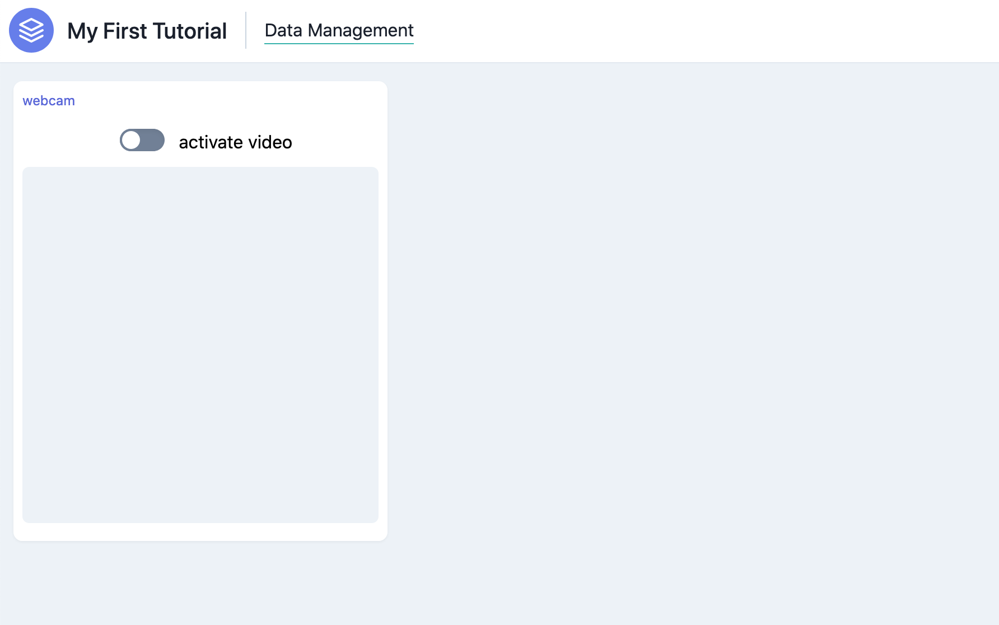

# Tutorial

In this tutorial, you will learn how to build a simple Marcelle application that allows the user to capture and annotate images from a webcam, train a classifier, assess it on the dataset, and play with real-time recognition. It is a toy example in Interactive Machine Learning, implemented in [Teachable Machine](https://teachablemachine.withgoogle.com/).

## Setting up

The easiest way to set up your application is by using the dedicated [Marcelle CLI tools](https://github.com/marcellejs/cli)). First install the Marcelle CLI tools:

```bash
$ npm install -g @marcellejs/cli
```

Then, create a folder for the app and run the CLI command:

```bash
$ mkdir marcelle-tutorial
$ cd marcelle-tutorial
$ marcelle generate app
```

## App basics

Marcelle is a client-side JavaScript framework. All Marcelle applications run in the browser without the need for communication with a Web server. In its simplest form, a Marcelle application is a webpage defined by `index.html` and a script file `src/index.ts` (or `src/index.js` if you chose JavaScript as language when generating your app).

To see the application running, type the command:

```bash
$ yarn dev
```

Your app should be running at `http://localhost:8080/`. If everything went well you should have a blank page. Let's now inspect what's your app is made of. Select the file `src/script.ts` (or `src/script.js`), that contains the most minimal skeleton of a marcelle application. In the file you should see some `import` commands and that's it. The application is therefore empty but all the modules are imported. We can now start to design our app.

## Data input

In our app, we want to capture images in order to interactively build a classifier. Images will be captured from the webcam. In Marcelle, a [webcam module](../api/modules.html#webcam) can easily be used by declaring it in the script:

```js
const input = webcam();
```

Note that if you look at the app in your browser (at `http://localhost:8080/`), you will still see a blank page. In fact, Marcelle allows you to build you ML pipelines and choose which elements to display on an interface.

## Showing the interface

Two types of interfaces are currently available: [Dashboards](../api/interfaces.html#dashboards) or Wizard [Wizards](../api/interfaces.html#wizards). In this tutorial we will create a dashboard where we will add elements from the pipeline that we would like to display. To create a dashboard, the API provides a `.createDashboard()` function:

```js
const dashboard = createDashboard({
  title: 'My First Tutorial',
  author: 'Marcelle Crew',
});
```

Then to visualise the created dashobaord, we need to `start` it:

```js
dashboard.start();
```

Now, you should see an empty dashboard in the browser.


To display a module on the dashboard, we first to create a page (see the [dashboard API](../api/interfaces.html#dashboards) for more details) and specificy all the modules disaplyed on this dashboard page with the `.useLeft()` and `.use()` functions. `.useLeft()` adds modules on the left column of the dashboard while the `.use()` function adds modules on the main central column. In this tutorial we will add the webcam on the left of a dashboard page called "Data Management". Above the `dashboard.start();` statement:

```js
dashboard.page('Data Management').useLeft(input);
```

Which should look like this:



## Building the ML pipeline

### Feature extraction and dataset creation

If we want to build a classifier that takes images as inputs and that can be trained efficiently with few samples, we cannot use the raw image. We need to extract features that are well suited for the task. To do so, we could use a pre-trained model called `Mobilenet` that takes an image as input (whose size is 224 x 224 x 3 so 150528 dimensions) and outputs a vector with lower dimension. To declare a mobilenet feature extractor in Marcelle, we do:

```js
const featureExtractor = mobilenet();
```
