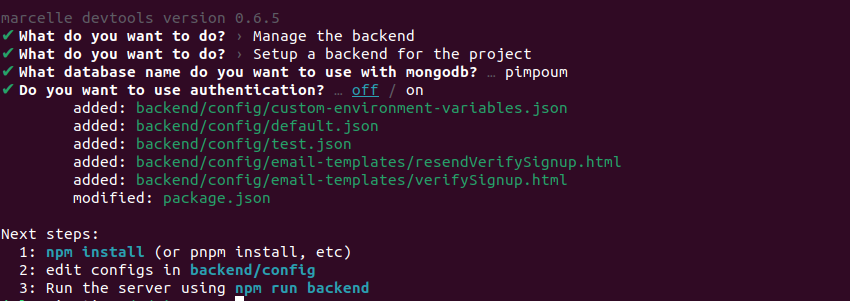

# Server-Side Data Storage

Marcelle provides a dedicated package for server-side data storage: [`@marcellejs/backend`](https://www.npmjs.com/package/@marcellejs/backend). It can easily be integrated into existing Marcelle applications using the CLI, and only require minimal configuration for local use.

Marcelle backends are [FeathersJS](https://docs.feathersjs.com/) applications, that provide persistent data storage with MongoDb.

## Prerequisites

Marcelle's backend system uses Node.js, with the Feathers.js framework, and a MongoDB database. It requires:

- Node.js v18 or later – Install the latest LTS version from the official site: https://nodejs.org/en/download/
- A MongoDB database, that can either be:
  - installed locally, with [MongoDB Community Server](https://www.mongodb.com/try/download/community)
  - hosted online, for example using [MongoDB Atlas](https://www.mongodb.com/products/platform/atlas-database)

## Adding a backend to an existing application

A backend can be added to a Marcelle application using the [CLI](/guides/devtools/devtools):

::: code-group

```bash [npm]
npx marcelle
```

```bash [yarn]
yarn marcelle
```

```bash [pnpm]
pnpx marcelle
```

:::

Select 'Manage the backend', then 'Setup a backend for the project'. This will install `@marcellejs/backend` as a dependency to your project and create the default configuration files.



Then, follow the intructions generated by the development tools. First, reinstall dependencies to include marcelle's backend package:

::: code-group

```bash [npm]
npm i
```

```bash [yarn]
yarn
```

```bash [pnpm]
pnpm i
```

:::

The development tools should have added a new script to your project's `package.json`. To run the backend locally:

```sh
npm run backend
```

The backend API will be available on [http://localhost:3030](http://localhost:3030). From a Marcelle application, interacting with this backend can be done through data stores, by instanciating them with the server URL as `location` parameter:

```js
const store = dataStore('http://localhost:3030');
```

## Configuration

Backends can be configured through JSON files located in the `backend/config` directory, for development of production. Defaults are stored in the `default.json` file. It will be merged with other configuration files in the config/ folder using the NODE_ENV environment variable. So setting NODE_ENV=production will merge `config/default.json` with `config/production.json`.

Please refer to [Feather's documentation](https://feathersjs.com/api/configuration.html) for more information about Feathers configuration.

See the [full reference](/api/backend/) of Marcelle's configuration file.

## Next steps

Once the backend is generated with default settings, it is possible to setup authentication, manage roles and permissions.
