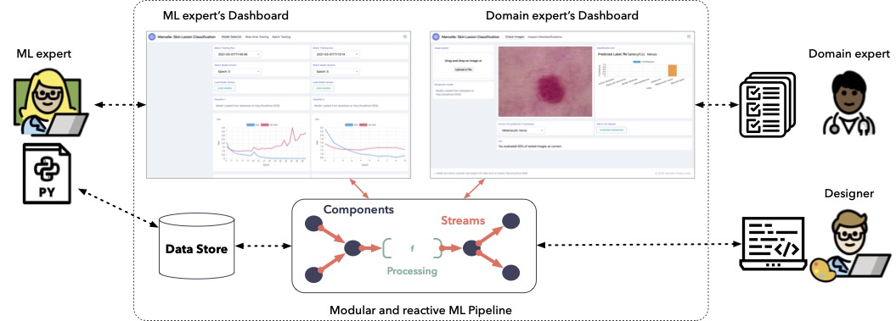
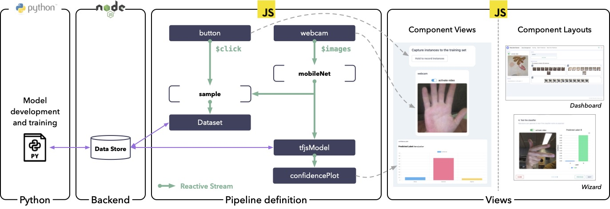
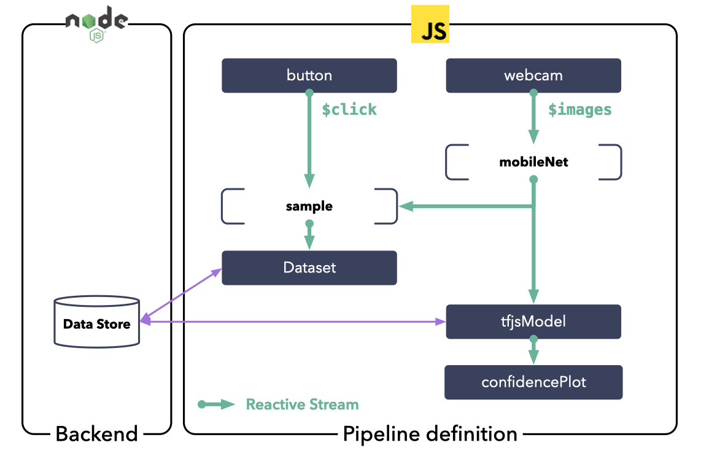

# Introduction

::: warning TODO

update introduction

:::

**Marcelle** is a modular open source toolkit for programming interactive machine learning applications. Marcelle is built around components embedding computation and interaction that can be composed to form reactive machine learning pipelines and custom user interfaces. This architecture enables rapid prototyping and extension. Marcelle can be used to build interfaces to Python scripts, and it provides flexible data stores to facilitate collaboration between machine learning experts, designers and end users.

  

    

      <a href="/guides/getting-started.html" class="action-button primary">Get Started →</a>
    

  

::: warning ⚠️ Experimental
Marcelle is still experimental and is currently under active development. Breaking changes are expected.
:::

<!-- ## Example

The following screenshot shows a simple example of application with an interactive dashboard dedicated to training an image recognizer using training examples captured from the webcam. The application, along with the source code, is available online on [Glitch](https://glitch.com/~marcelle-v2-dashboard).

 -->

<!-- ## 30s to Marcelle

<iframe width="560" height="315" src="https://www.youtube-nocookie.com/embed/GPNBlJMunNA" title="YouTube video player" frameborder="0" allow="accelerometer; autoplay; clipboard-write; encrypted-media; gyroscope; picture-in-picture" allowfullscreen></iframe> -->

## Architecture

Marcelle's architecture relies on 5 main design principles.

### Component-based architecture

Interactive Machine Learning applications involve a large number of activities and tasks, meaning that users need to manipulate different concepts and objects of interest.
We propose a modular architecture where the building blocks for designing interactions are components embedding data, computation and interaction.
Components can typically be data sources (for instance a webcam capturing images), data structures (such as datasets), models, or visualization.
Most components provide a graphical user interface that can be displayed on demand.
In Marcelle, components are JavaScript objects created with factory functions. Marcelle uses Svelte internally, however any JavaScript framework can be used for custom components.

### Composable interfaces

In their review of user interface design in IML, Dudley and Kristensson emphasize that while interfaces share common elements, their layout often varies according to the task and context.
We propose that toolkits should offer layout mechanisms facilitating user interface composition.

In our implementation, we provide two types of layouts: dashboards composed of several pages displaying sets of components, and wizards where components are arranged into step by step guides.
Both can be created using a high-level API for organizing components on pages.

### Interaction-driven pipelines

Interactive machine learning applications involve custom workflows where user interactions trigger various types of processing. Therefore, there is a need for pipelines specifying complex relationships between the users actions and these operations.
We propose a design where developers can build reactive pipelines that propagate change. Components expose arbitrary event streams that can be consumed by other components, and which can be processed outside components.
Our implementation relies on reactive programming, a paradigm that facilitates the creation, filtering, transformation and combination of event streams. It enables encapsulated, loosely coupled components where streams act as an interface.

### Data Persistence and Communication

Our goal is to support collaboration between various stakeholders including machine learning engineers, end users such as domain experts, and designers. We propose the use of flexible data stores supporting heterogeneous data (such as instances, models, results or logs).
Our implementation relies on the FeathersJS Framework, and enables developers to specify where each store’s data should be stored (be it locally or on remote servers).

### Python interoperability

Since Python has become a language of choice for machine learning, it is essential to provide interoperability with Python. As a first step, our implementation provides partial support for exchanging models and data between Marcelle and Tensorflow.

