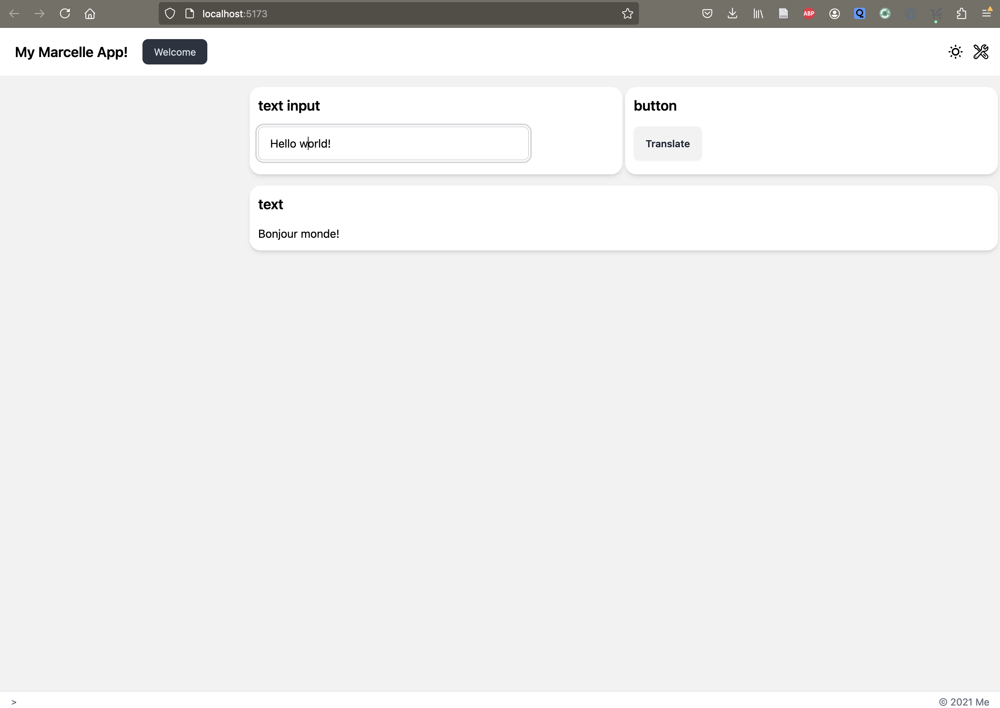

# Server-side Inference

TODO: Intro

## Serving a Python Model with Ray

Ray is a powerful library for distributed computing that makes it easy to serve machine learning models. This guide provides a quick walkthrough on how to serve a Python model using Ray's Serve module for inference and send queries from a Marcelle app.

In this guide, we will implement the scenario where a pre-trained model translates a text input in English into French.

To do this, we'll be using the [🤗 HuggingFace's Transformers](https://huggingface.co/docs/transformers/v4.17.0/en/index) python library.

### Step 1: Serve a model with Ray

In this first step we will create two python files: `serve_model.py` and `test_query.py`.

#### Create a translation model

In `serve_model.py`, define a class to wrap your model logic using the Transformers python library. The class includes a `translate` method to run the inferece:

```python
import json
from transformers import pipeline

class MyModel:
    def __init__(self):
        # Load or initialize your model here
        self.model = pipeline("translation_en_to_fr", model="t5-small")

    def translate(self, data):
        result = self.model(data['text'])
        return result[0]["translation_text"]

```

#### Use Ray to serve the model

To serve the model using Ray Serve, you need to add the `@serve.deployment` decorator and add a `__call__` method that handles the requests:

```python
...
from starlette.responses import Response
from ray import serve

@serve.deployment
class MyModel:
    ...

    async def __call__(self, request):
        # Process the input and generate predictions
        data = await request.json()
        return Response(
            json.dumps({'translated_text': self.translate(data)}),
            media_type='text/json',
            headers={'Access-Control-Allow-Origin': "*"},
        )
```

The object returned is a Starlette's Response with the translated text in the form of a dict, its type and headers that allow requests from any origin (which is not very good practice for security).

#### Serve your model

Serve the model using the `bind()` method at the end of your python script:

```python
translator = MyModel.bind()
```

And run the following command in the terminal:

```sh
serve run serve_model:translator
```

By default, the model is served on port `8000` of `localhost`.

#### Test the deployment

You can query the deployed model using any HTTP client, such as `requests`. `test_query.py`, do:

```python
import requests

text = {"text": "Hello world!"}
url = "http://127.0.0.1:8000/"

response = requests.post(url, json=text)

print(response.json())
```

Running this code in a terminal, with the Ray server also running, should return:

```
{'translated_text': 'Bonjour monde!'}
```

### Step 2: Make the query from a Marcelle app

#### Create a Marcelle app

Start by generating a new Marcelle app:

::: code-group

```bash [npm]
npm init marcelle marcelle-ray-simple
cd marcelle-ray-simple
npm install
```

```bash [yarn]
yarn create marcelle marcelle-ray-simple
cd marcelle-ray-simple
yarn
```

```bash [pnpm]
pnpm create marcelle marcelle-ray-simple
cd marcelle-ray-simple
pnpm i
```

:::

If you want to know more about creating Marcelle apps, see the [quickstart guide](../quickstart)

In this guide, we will work in the `index.js` file.

#### Create a simple interface to create the queries

We start by creating a simple interface to interact with the translation model served up by Ray. We need a text input component to allow users to write their query ([`textInput`](../../api/gui-widgets/components.html#text-input) component), a button that will be used to submit the query ([`button`](../../api/gui-widgets/components.html#button) component) and a text field to display the response after translation ([`text`](../../api/gui-widgets/components.html#text) component).

Instantiate the necessary components from the `@marcellejs/gui-widgets` package:

```js
import { textInput, button, text } from '@marcellejs/gui-widgets';

const x = textInput('Query');
const t = text('Translated text');
const b = button('Translate');
```

Add the components to the dashboard:

```js
dash.page('Welcome').use([x, b]).use(t);
```

#### Send the query

We send a request via http to the Ray server which is serving on port `8000`. The query used the current value in the textInput component given by `x.$value.getValue()` and display the resul in the text field through `t.$value.next()`:

```js
function query() {
  fetch('http://127.0.0.1:8000/', {
    method: 'POST',
    body: JSON.stringify({ text: x.$value.getValue() }),
  })
    .then((response) => {
      if (!response.ok) {
        throw new Error(`HTTP error! Status: ${response.status}`);
      }
      return response.json();
    })
    .then((data) => {
      t.$value.next(data.translated_text);
      console.log('Response:', data);
    })
    .catch((error) => {
      console.error('Error:', error);
    });
}
```

Send the query when clicking on the button:

```js
b.$click.subscribe(() => {
  query();
});
```

#### Results

This is what you should be seeing in the interface:



### Conclusion

Ray Serve is widely used for deploying and scaling Python models, compatible with the usual frameworks: PyTorch, Tensorflow, Keras, Scikit-learn, HuggingFace, etc.

With Marcelle, you can easily make requests to a served model and get the results in an interface.

## Serving a Model through the DataStore

TODO
