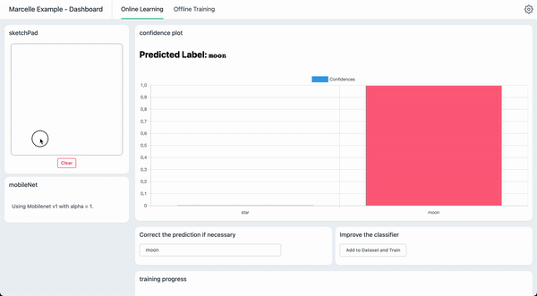
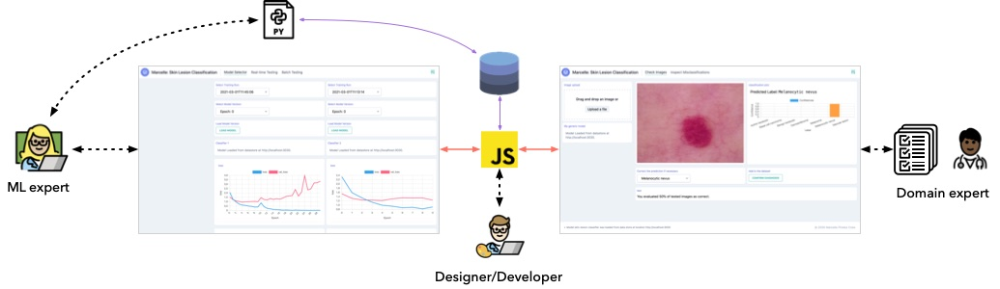

---
# https://vitepress.dev/reference/default-theme-home-page
layout: home

hero:
  name: 'Marcelle'
  text: 'A Toolkit for Composing Interactive Machine Learning Workflows and Interfaces'
  tagline: ''
  image:
    src: /images/intro-blob.png
    alt: VitePress
  actions:
    - theme: brand
      text: Get Started
      link: /guide/
    - theme: alt
      text: Try the demos
      link: https://marcelle-demos-next.netlify.app/
# features:
#   - title: Feature A
#     details: Lorem ipsum dolor sit amet, consectetur adipiscing elit
#   - title: Feature B
#     details: Lorem ipsum dolor sit amet, consectetur adipiscing elit
#   - title: Feature C
#     details: Lorem ipsum dolor sit amet, consectetur adipiscing elit
---

::: warning
This website document the next big update to Marcelle. It is unstable and breaking changes are expected. The current stable version is documented at [https://marcelle.dev/](https://marcelle.dev/)
:::

**Marcelle** is a modular open source toolkit for programming interactive machine learning applications. Marcelle is built around components embedding computation and interaction that can be composed to form reactive machine learning pipelines and custom user interfaces. This architecture enables rapid prototyping and extension. Marcelle can be used to build interfaces to Python scripts, and it provides flexible data stores to facilitate collaboration between machine learning experts, designers and end users.

---

<strong>Design Human-AI interactions in minutes.</strong> 
Marcelle provides a high-level API enabling rapid prototyping of applications where human directly interact with machine learning systems.

<!--  -->

---

<h2 class="centered">Features</h2>

<strong>Modular</strong> 
Marcelle is built around various components providing a graphical user interface that can be displayed on demand.
Components can typically be data sources (for instance a webcam capturing images), data structures (such as datasets), models, or visualization.

<strong>Composable</strong> 
Marcelle provides two layout mechanisms for user interface composition: dashboards and wizards.

<strong>Interaction-Driven</strong> 
Marcelle emphasizes machine learning pipelines driven by user interactions, through reactive programming.

<strong>Designed for collaboration</strong> 
Marcelle's data stores enable sharing data and models among stakeholders

