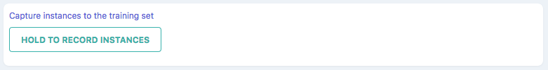

# Common Widgets

## Button

```ts
marcelle.button({ text: string }): Button;
```

A generic GUI button component.

### Parameters

| Option | Type            | Description            | Required |
| ------ | --------------- | ---------------------- | :------: |
| text   | string/function | The text of the button |          |

### Streams

| Name    | Type      | Description                                                 | Hold |
| ------- | --------- | ----------------------------------------------------------- | :--: |
| \$click | undefined | Stream of click events                                      |      |
| \$down  | boolean   | Stream of binary events indicating is the button is pressed |      |
| \$text  | boolean   | Stream defining the button text                             |      |

### Screenshot



### Example

```js
const capture = marcelle.button({ text: 'Hold to record instances' });
capture.name = 'Capture instances to the training set';

capture.$click.subscribe(console.log);
```

## Textfield

```ts
marcelle.textfield(): Textfield;
```

A generic GUI text field (input) component.

### Streams

| Name   | Type    | Description                       | Hold |
| ------ | ------- | --------------------------------- | :--: |
| \$text | boolean | Stream defining the input's value |      |

### Screenshot


### Example

```js
const label = marcelle.textfield();
label.name = 'Instance label';

label.$text.subscribe(console.log);
label.$text.set('myLabel');
```

## Toggle​

## Text

## Plotter
