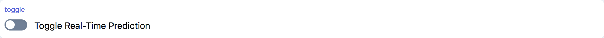

# Common Widgets

## Button

```tsx
marcelle.button({ text: string }): Button;
```

A generic GUI button component.

### Parameters

| Option | Type            | Description            | Required |
| ------ | --------------- | ---------------------- | :------: |
| text   | string/function | The text of the button |          |

### Streams

| Name    | Type      | Description                                                 | Hold |
| ------- | --------- | ----------------------------------------------------------- | :--: |
| \$click | undefined | Stream of click events                                      |      |
| \$down  | boolean   | Stream of binary events indicating is the button is pressed |      |
| \$text  | boolean   | Stream defining the button text                             |      |

### Screenshot

<div style="background: rgb(237, 242, 247); padding: 8px; margin-top: 1rem;">
  
</div>

### Example

```js
const capture = marcelle.button({ text: 'Hold to record instances' });
capture.name = 'Capture instances to the training set';

capture.$click.subscribe((x) => console.log('button $click:', x));
```

## Plotter

```tsx
marcelle.plotter({
  series?: PlotterSeries;
  options?: ApexOptions;
}): Plotter;
```

A generic charting component based on [ApexCharts](https://apexcharts.com/). The component takes as argument one or several series of data to be plotted, and optionnaly a set of ApexCharts options.

### Parameters

| Option  | Type          | Description                                                                                                                                                               | Required |
| ------- | ------------- | ------------------------------------------------------------------------------------------------------------------------------------------------------------------------- | :------: |
| series  | PlotterSeries | An array of data series to display (see type elow)                                                                                                                        |          |
| options | ApexOptions   | An object specifying the ApexChart's plotting options. The full reference is available in ApexCharts's [documentation](https://apexcharts.com/docs/options/annotations/). |          |

The series have the following type definition:

```ts
type PlotterSeries = Array<{
  name: string;
  data: Stream<number[]> | Stream<{ x: string; y: number }[]>;
}>;
```

### Screenshot

<div style="background: rgb(237, 242, 247); padding: 8px; margin-top: 1rem;">
  
</div>

### Example

```js
const series1 = marcelle
  .createStream(mostCore.periodic(500))
  .thru(mostCore.map(() => Array.from(Array(12), Math.random)));
const series2 = series1.thru(mostCore.map((x) => x.map((y) => 1 - y + 0.4 * Math.random())));
const plotterExample = marcelle.plotter({
  series: [
    { name: 'series 1', data: series1 },
    { name: 'series 2', data: series2 },
  ],
  options: {
    xaxis: { title: { text: 'x label' } },
    yaxis: { title: { text: 'y label' } },
  },
});
```

## Text

```tsx
marcelle.text({ text: string }): Text;
```

A generic GUI text display component accepting HTL strings.

### Parameters

| Option | Type            | Description             | Required |
| ------ | --------------- | ----------------------- | :------: |
| text   | string/function | The text of the togggle |          |

### Streams

| Name   | Type    | Description                      | Hold |
| ------ | ------- | -------------------------------- | :--: |
| \$text | boolean | Stream defining the text content |      |

### Screenshot

<div style="background: rgb(237, 242, 247); padding: 8px; margin-top: 1rem;">
  
</div>

### Example

```js
const t = marcelle.text({
  text:
    'Just some <strong>HTML</strong> text content... Accepts HTML: <button class="btn">button</button>',
});
```

## Textfield

```tsx
marcelle.textfield(): Textfield;
```

A generic GUI text field (input) component.

### Streams

| Name   | Type    | Description                       | Hold |
| ------ | ------- | --------------------------------- | :--: |
| \$text | boolean | Stream defining the input's value |      |

### Screenshot

<div style="background: rgb(237, 242, 247); padding: 8px; margin-top: 1rem;">
  
</div>

### Example

```js
const label = marcelle.textfield();
label.name = 'Instance label';

label.$text.subscribe(console.log);
label.$text.set('myLabel');
```

## Toggle​

```tsx
marcelle.toggle({ text: string }): Toggle;
```

A generic GUI toggle (switch) component.

### Parameters

| Option | Type            | Description             | Required |
| ------ | --------------- | ----------------------- | :------: |
| text   | string/function | The text of the togggle |          |

### Streams

| Name       | Type    | Description                               | Hold |
| ---------- | ------- | ----------------------------------------- | :--: |
| \$text     | boolean | Stream defining the toggle text           |      |
| \$checked  | boolean | Stream defining if the toggle is checked  |      |
| \$disabled | boolean | Stream defining if the toggle is disabled |      |

### Screenshot

<div style="background: rgb(237, 242, 247); padding: 8px; margin-top: 1rem;">
  
</div>

### Example

```js
const tog = marcelle.toggle({ text: 'Toggle Real-Time Prediction' });
tog.$checked.subscribe((x) => console.log('toggle $checked:', x));
```
